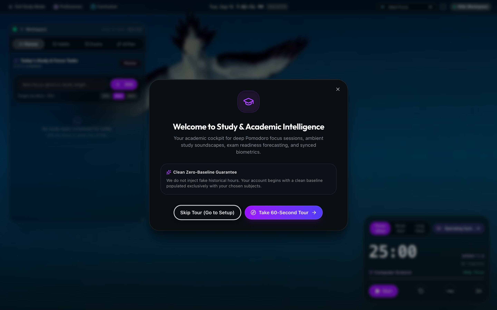
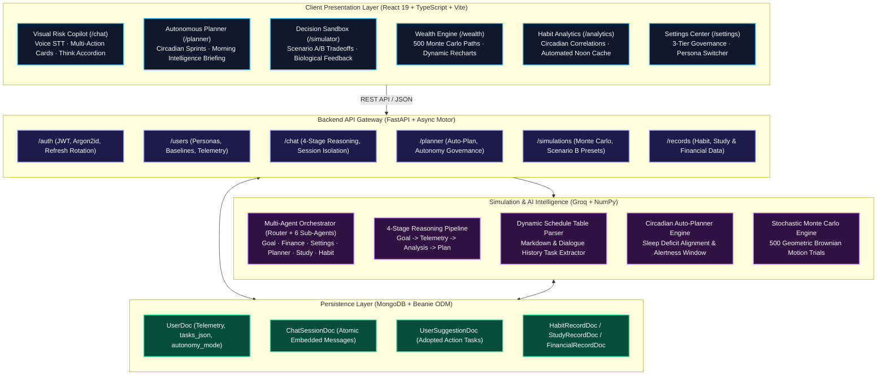
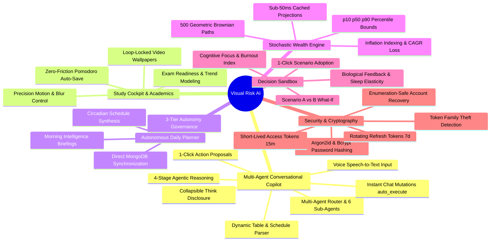
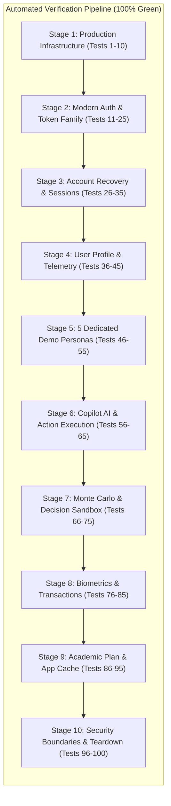

<p align="center">
  
</p>

<h1 align="center">Visual Risk AI</h1>

<p align="center">
  <b>AI-Based Visual Risk and Compliance Intelligence System (VRCI)</b><br />
  <i>Agentic Decision Intelligence · Circadian Biological Twins · Stochastic Monte Carlo Modeling · Autonomous AI Planner</i>
</p>

<p align="center">
  
</p>

<p align="center">
  Visual Risk AI (VRCI) is an agentic, intelligent risk, compliance, and decision-support system that models, forecasts, and optimizes trajectories across operational compliance, financial risk, health, cognitive performance, and daily habits. By combining stochastic Monte Carlo simulations, deterministic compound growth algorithms, biological circadian feedback models, and conversational agentic intelligence (Groq GPT-OSS 120B / 20B & Qwen 3.6), the platform creates a living digital twin tailored to the user's specific life stage.
</p>

---

## Visual Interface & Dashboard Showcase

Explore the core modules of Visual Risk AI. Click on any screenshot to inspect the full-resolution image in a new tab:

### 01. Landing & Persona Portal
The primary onboarding gateway introducing the 5 life-stage demographic personas (Student, Professional, Freelancer, Tech Lead, Custom) with immediate baseline telemetry configuration.

<p align="center">
  <a href="docs/images/01_landing.png" target="_blank">
    
  </a>
</p>

---

### 02. Living Digital Twin Dashboard (`/dashboard`)
The central telemetry command center displaying real-time cognitive Vitality & Health Index gauges, financial cashflow surplus, today's circadian schedule, and long-term milestone progress.

<p align="center">
  <a href="docs/images/02_dashboard.png" target="_blank">
    
  </a>
</p>

---

### 03. Visual Risk Copilot & Multi-Agent Chat (`/chat`)
Conversational agentic intelligence powered by a specialized Multi-Agent Router and 6 Domain Sub-Agents. Includes 4-stage transparent reasoning disclosure, speech-to-text voice input, and 1-click database mutation execution.

<p align="center">
  <a href="docs/images/03_copilot_chat.png" target="_blank">
    
  </a>
</p>

---

### 04. Decision Sandbox & What-If Tradeoff Simulator (`/simulator`)
Side-by-side comparative simulation comparing Scenario A vs Scenario B over 5 to 40-year horizons. Models biological feedback loops, sleep deficit penalties, and net worth opportunity costs in real time.

<p align="center">
  <a href="docs/images/04_simulator.png" target="_blank">
    
  </a>
</p>

---

### 05. Wealth Engine & Stochastic Monte Carlo Simulation (`/wealth`)
500-run Geometric Brownian Motion simulations generating p10, p50 (median), and p90 confidence bands with real-time CAGR loss calculations and inflation-adjusted milestone probabilities.

<p align="center">
  <a href="docs/images/05_wealth_planner.png" target="_blank">
    
  </a>
</p>

---

### 06. Habit Analytics & Circadian Health Index (`/analytics`)
Biometric and habit correlation telemetry mapping sleep duration, exercise, and study volume against cognitive focus scores. Automatically caches daily reflections and health recommendations at 12:00 PM.

<p align="center">
  <a href="docs/images/06_habit_analytics.png" target="_blank">
    
  </a>
</p>

---

### 07. Autonomous Daily Planner (`/planner`)
Circadian schedule synthesis aligning deep work focus sprints with peak cognitive cortisol windows. Supports Morning Intelligence briefings and 1-click AI suggestion adoption.

<p align="center">
  <a href="docs/images/07_task_planner.png" target="_blank">
    
  </a>
</p>

---

### 08. Study Cockpit & Academic Intelligence (`/study`)
Academic productivity cockpit featuring AI-synthesized 7-day Pomodoro sprint schedules, spaced repetition algorithms, exam target readiness curves, and loop-locked ambient video soundscapes.

<p align="center">
  <a href="docs/images/11_study_cockpit.png" target="_blank">
    
  </a>
</p>

---

### 09. Settings & 3-Tier Autonomy Governance (`/settings`)
Governance center providing 3-tier autonomy controls (Manual Review, Semi-Autonomous with Undo Window, Fully Autonomous), Think Mode telemetry toggles, and instant persona switching.

<p align="center">
  <a href="docs/images/08_settings.png" target="_blank">
    
  </a>
</p>

---

### 10. Secure Authentication & Onboarding (`/login` & `/signup`)
Cryptographically secure authentication with Argon2id and Bcrypt password hashing, short-lived 15-minute access tokens, rotating 7-day refresh token cookies, and 1-click demo persona access.

<p align="center">
  <a href="docs/images/10_login.png" target="_blank">
    
  </a>
</p>

---

## System Architecture Overview



---

## Core Capabilities & Feature Highlights



---

## Complete Documentation Directory

- [**01. Core Capabilities**](docs/core_capabilities.md) — Comprehensive feature matrix, reasoning pipeline, and autonomy governance.
- [**02. The 5 User Personas**](docs/user_personas.md) — Detailed baseline metrics, circadian parameters, and goals for all 5 roles.
- [**03. System Architecture & Flowchart**](docs/system_architecture.md) — Detailed component interconnects, Mermaid diagrams, and data flow.
- [**04. Tech Stack & Engineering Architecture**](docs/tech_stack.md) — Frontend, backend, AI engine, and database stack specifications.
- [**05. Quickstart & Installation Guide**](docs/quickstart_guide.md) — Step-by-step installation, environment setup, and startup commands.
- [**06. Running the Application & Deployment**](docs/running_the_application.md) — Production build, docker deployment, and daemon process management.
- [**07. Complete API Reference & Example Payloads**](docs/api_reference.md) — Complete REST endpoint specifications, request schemas, and curl examples.
- [**08. Authentication & Security Architecture (15 Principles)**](docs/authentication_architecture.md) — Threat models, token lifecycles, and cryptographic standards.

---

## Step-by-Step Workflow Guides

1. [**01. System Architecture & Data Flow**](docs/workflow/01_system_architecture.md)
2. [**02. Onboarding & Persona Architecture**](docs/workflow/02_onboarding_and_personas.md)
3. [**03. Financial Forecasting & Monte Carlo Simulation**](docs/workflow/03_forecasting_and_monte_carlo.md)
4. [**04. Decision Sandbox & What-If Simulation**](docs/workflow/04_decision_sandbox_and_whatif.md)
5. [**05. Habit Analytics & Daily Noon Cache**](docs/workflow/05_habit_analytics_and_feedback.md)
6. [**06. Task Planner & Suggestion Adoption Engine**](docs/workflow/06_task_planner_and_suggestions.md)
7. [**07. Study & Productivity Intelligence**](docs/workflow/07_study_and_productivity_intelligence.md)
8. [**08. Visual Risk Copilot & Conversational Agent**](docs/workflow/08_digital_twin_copilot_chat.md)

---

## Exhaustive Verification & Test Coverage

The platform is backed by an automated 100-test end-to-end verification suite and complete pytest unit tests:



To execute the test suite:
```bash
# Run automated pytest unit & integration tests (21/21 passing)
PYTHONPATH=. .venv/bin/pytest tests/ -v

# Run comprehensive live MongoDB end-to-end suite (76/76 passing)
PYTHONPATH=. .venv/bin/python test_live_mongodb_e2e.py

# Run complete 100 E2E benchmark tests (100/100 passing)
PYTHONPATH=. .venv/bin/python run_exact_100_e2e_tests.py
```

---

*Visual Risk AI — Intelligent Multi-Persona Trajectory Engine.*
