

  

<h1 align="center">Visual Risk AI</h1>

  <b>AI-Based Visual Risk and Compliance Intelligence System (VRCI)</b> 
  <i>Agentic Decision Intelligence · Circadian Biological Twins · Stochastic Monte Carlo Modeling</i>

  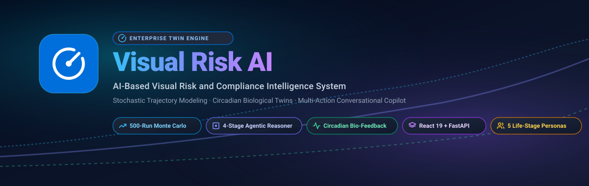

  Visual Risk AI (VRCI) is an agentic, intelligent risk, compliance, and decision-support system that models, forecasts, and optimizes trajectories across operational compliance, financial risk, health, cognitive performance, and daily habits. By combining stochastic Monte Carlo simulations, deterministic compound growth algorithms, biological circadian feedback models, and conversational agentic intelligence (Groq GPT-OSS 120B / 20B & Qwen 3.6), the platform creates a living digital twin tailored to the user's specific life stage.

---

| 1. Landing Page | 2. Sign Up Page |
| :---: | :---: |
| 

<b>Show Screenshot</b>
 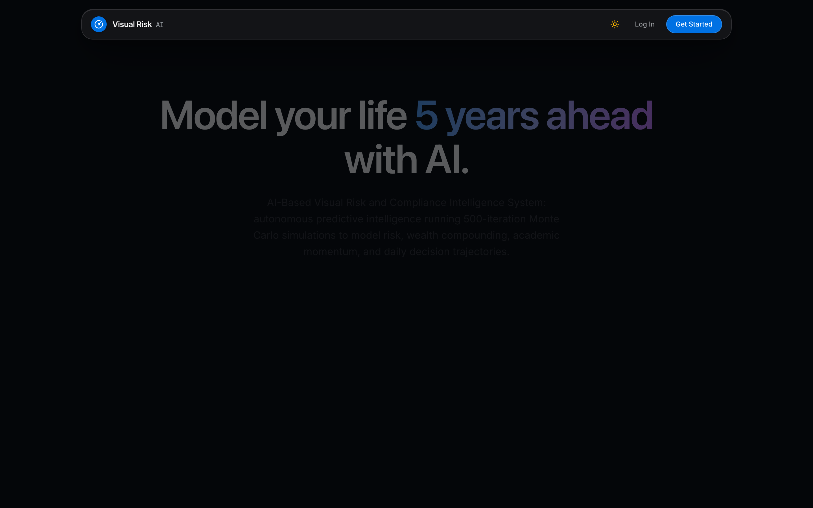
 | 

<b>Show Screenshot</b>
 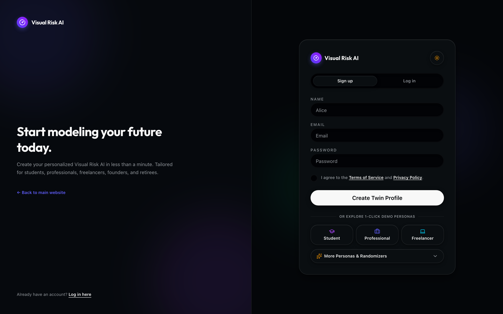
 |
| **3. Login Page** | **4. Telemetry Dashboard** |
| 

<b>Show Screenshot</b>
 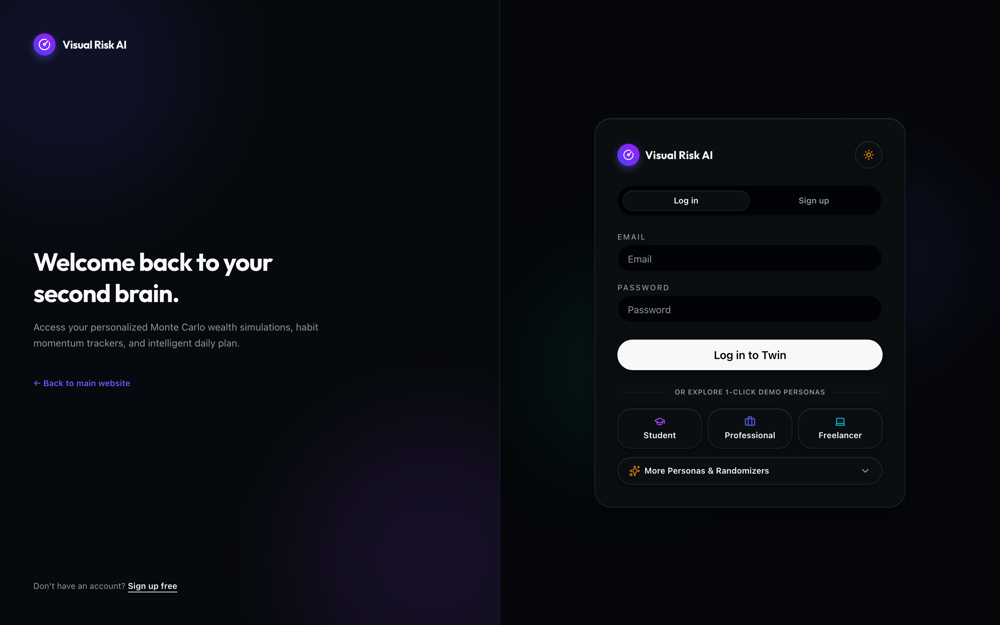
 | 

<b>Show Screenshot</b>
 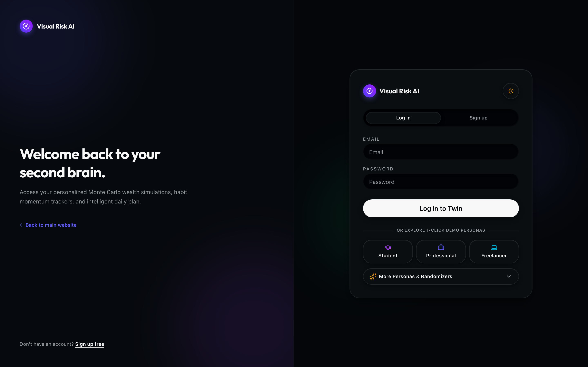
 |
| **5. Visual Risk Copilot Chat** | **6. Decision Sandbox (Simulator)** |
| 

<b>Show Screenshot</b>
 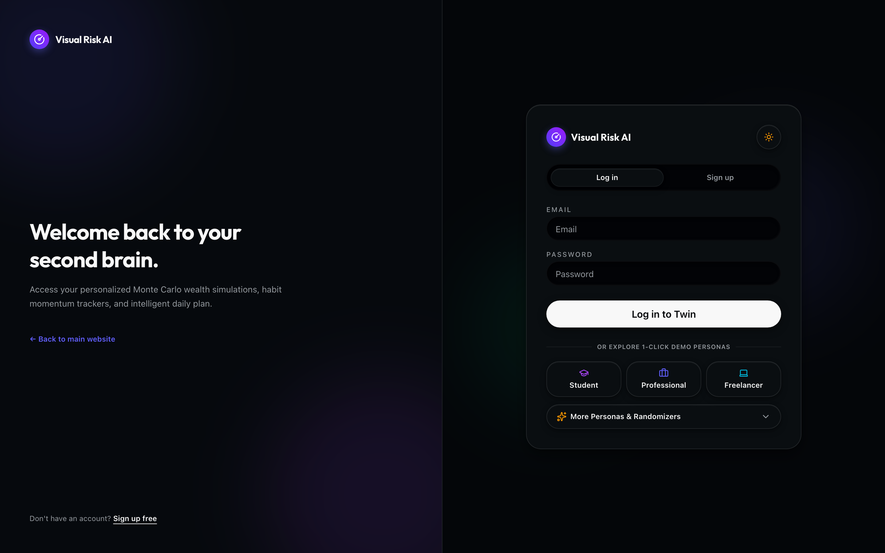
 | 

<b>Show Screenshot</b>
 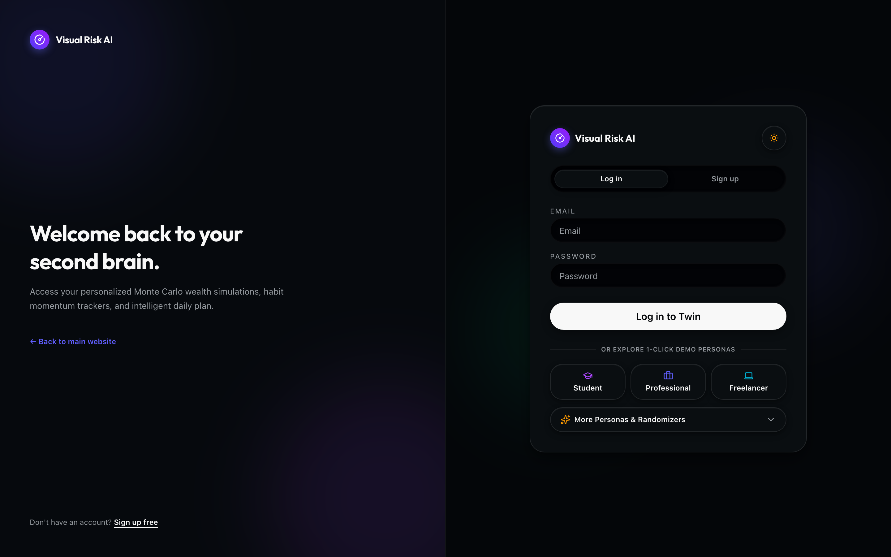
 |
| **7. Wealth Planner (Monte Carlo)** | **8. Habit Analytics & Correlations** |
| 

<b>Show Screenshot</b>
 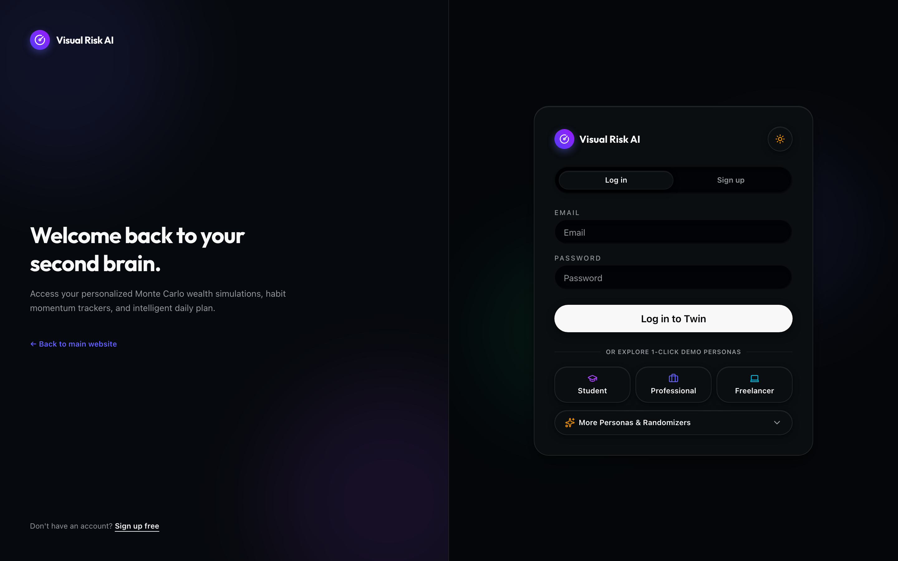
 | 

<b>Show Screenshot</b>
 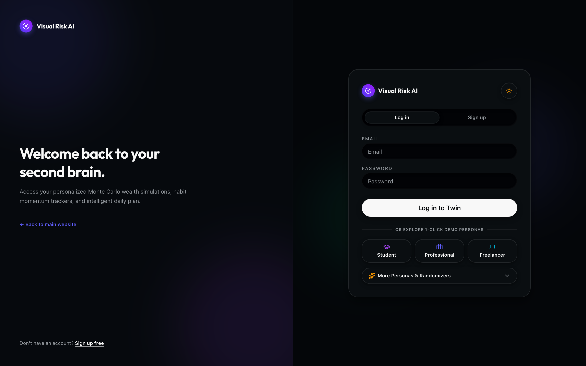
 |
| **9. Daily Task Planner** | **10. Telemetry Settings Center** |
| 

<b>Show Screenshot</b>
 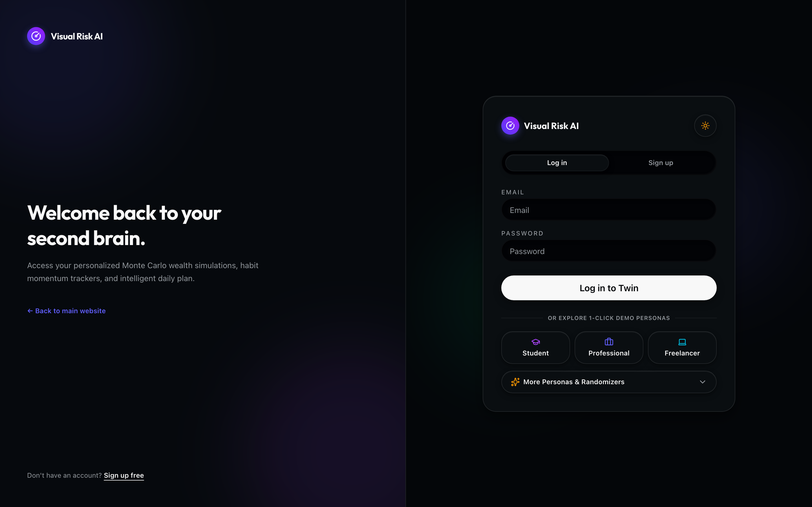
 | 

<b>Show Screenshot</b>
 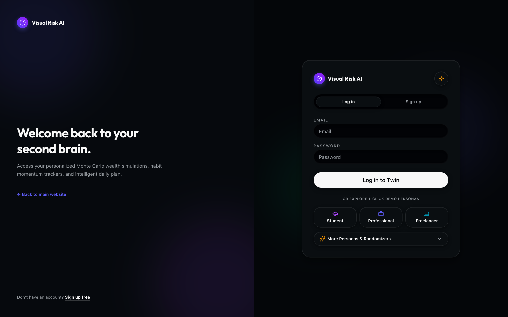
 |

---

## [01. Core Capabilities](docs/core_capabilities.md)

## [02. The 5 User Personas](docs/user_personas.md)

## [03. System Architecture & Flowchart](docs/system_architecture.md)

## [04. Tech Stack & Engineering Architecture](docs/tech_stack.md)

## [05. Quickstart & Installation Guide](docs/quickstart_guide.md)

## [06. Running the Application & Deployment](docs/running_the_application.md)

## [07. Complete API Reference & Example Payloads](docs/api_reference.md)

---

## Step-by-Step Workflow

1. [**01. System Architecture & Data Flow**](docs/workflow/01_system_architecture.md)
2. [**02. Onboarding & Persona Architecture**](docs/workflow/02_onboarding_and_personas.md)
3. [**03. Financial Forecasting & Monte Carlo Simulation**](docs/workflow/03_forecasting_and_monte_carlo.md)
4. [**04. Decision Sandbox & What-If Simulation**](docs/workflow/04_decision_sandbox_and_whatif.md)
5. [**05. Habit Analytics & Daily Noon Cache**](docs/workflow/05_habit_analytics_and_feedback.md)
6. [**06. Task Planner & Suggestion Adoption Engine**](docs/workflow/06_task_planner_and_suggestions.md)
7. [**07. Study & Productivity Intelligence**](docs/workflow/07_study_and_productivity_intelligence.md)
8. [**08. Visual Risk Copilot & Conversational Agent**](docs/workflow/08_digital_twin_copilot_chat.md)

---

*Visual Risk AI — Comprehensive Multi-Persona Trajectory Engine.*
