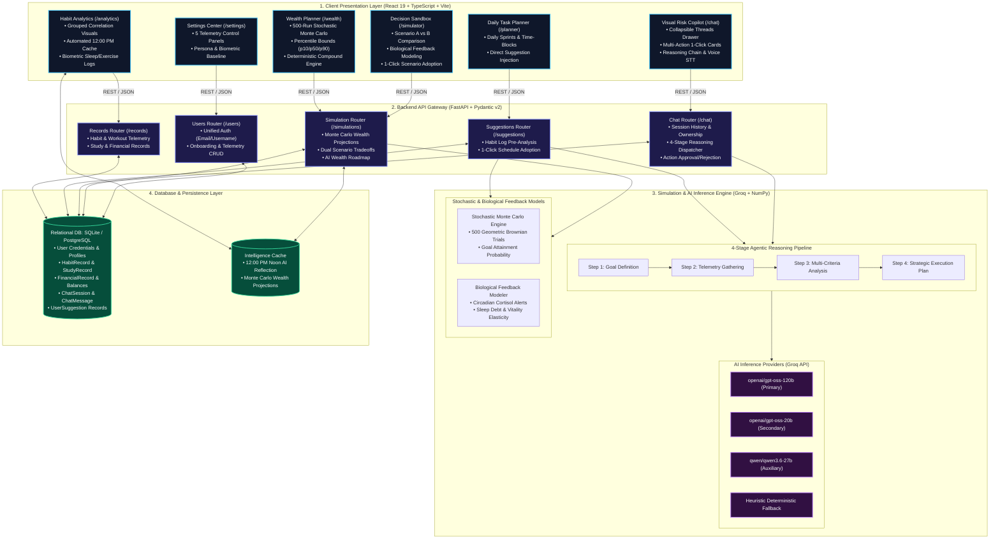

# Visual Risk AI — AI-Based Visual Risk and Compliance Intelligence System

Visual Risk AI (VRCI) is an agentic, intelligent risk, compliance, and decision-support system that models, forecasts, and optimizes trajectories across operational compliance, financial risk, health, cognitive performance, and daily habits.

By combining stochastic Monte Carlo simulations, deterministic compound growth algorithms, biological circadian feedback models, and conversational agentic intelligence (Groq GPT-OSS 120B / 20B & Qwen 3.6), the platform creates a living digital twin tailored to the user's specific life stage.

---

## Core Capabilities

### 1. Visual Risk Copilot & Conversational Agent
Agentic conversational assistant with real-time biometric and financial database connectivity, 4-stage reasoning disclosures, and voice dictation.

<details>
<summary><b>Show Details & Features</b></summary>

- **Fullscreen Interface (`/chat`)**: Modern conversational interface with collapsible sidebar, session history, and instant draft initialization without URL pollution.
- **4-Stage Agentic Reasoning Pipeline**:
  - **Step 1 — Goal Definition**: Explicitly decomposes user intent into optimization objectives.
  - **Step 2 — Telemetry Search & Data Gathering**: Queries real database records (sleep duration, sleep debt, screen time, study subjects, cash surplus, milestone progress).
  - **Step 3 — Multi-Criteria Analysis & Optimization**: Evaluates circadian alertness peaks (08:30–11:30), task load balancing, and elasticity projections (+1.8 Focus, +1.0 Vitality).
  - **Step 4 — Formulated Strategic Execution Plan**: Renders unbroken Markdown tables and interactive action proposals.
- **Step-by-Step Thought Process (`<think>`)**: Real-time collapsible reasoning disclosure detailing mathematical models, boundary checks, and intermediate metrics.
- **Voice Input (Speech-to-Text)**: Native browser voice dictation powered by the Web Speech API.

</details>

---

### 2. Interactive Multi-Action Execution Engine
Every Copilot recommendation includes an interactive, 1-click execution card for immediate database and schedule synchronization.

<details>
<summary><b>Show Details & Features</b></summary>

- **`add_multiple_tasks`**: Batch daily routine injection directly into the Daily Task Planner.
- **`add_task`**: Single time-block scheduling with custom duration, start time, and category.
- **`purchase_impact`**: Real-time capital friction analysis against active milestones, 5-year compounding opportunity cost (8% CAGR), and Monte Carlo retirement odds variance.
- **`simulate_what_if`**: Instant lifestyle tradeoff sandboxing with 1-click scenario adoption.
- **`wealth_forecast`**: 500-run stochastic projection with percentile bands (p10, median, p90) and retirement attainment probability.
- **`update_settings`**: In-chat profile parameter modification (income, expenses, sleep targets, retirement age) with 1-click database commit.
- **`log_habit` & `log_study`**: 1-click commit of biometric logs (exercise, sleep, screen time) and academic study sessions directly into `/analytics`.

</details>

---

### 3. Interactive Settings & Telemetry Control Center (`/settings`)
Comprehensive multi-panel configuration hub providing live profile reactivity and telemetry adjustments.

<details>
<summary><b>Show Details & Features</b></summary>

5 Dedicated configuration panels with live state reactivity:
1. **Persona & Role**: 5 interactive cards (Student, Professional, Freelancer, Entrepreneur, Retiree) with live previews.
2. **Biometrics & Daily Routine**: Interactive sliders for sleep baseline, study hours, screen time caps, and 7-day exercise selector.
3. **Financial Telemetry**: Monthly surplus calculator, net worth, 5-year compounding preview, and milestone progress.
4. **AI Intelligence Engine**: `<think>` reasoning toggle, Monte Carlo trial depth (250/500/1000), and proactive scheduling sensitivity.
5. **System & Data**: Theme toggles (Light/Dark), one-click JSON telemetry export, onboarding wizard rerun, and factory reset.

</details>

---

### 4. Financial Twin & Monte Carlo Forecasting (`/wealth`)
500-iteration stochastic wealth simulations and deterministic compound growth modeling.

<details>
<summary><b>Show Details & Features</b></summary>

- **500-Iteration Stochastic Wealth Simulations**: Log-normal market volatility simulations with percentile bounds (p10 Bear, p50 Median, p90 Bull).
- **Adaptive Multi-Scale Charts**: Dynamic Y-axis scaling handling values from student allowances in hundreds/thousands to venture founders and retirees in millions.
- **Intelligent Prediction Caching**: Automatic caching of computationally heavy forecasts for sub-50ms rendering.

</details>

---

### 5. Decision Sandbox & What-If Simulator (`/simulator`)
Dual-scenario sandboxing tool evaluating biological feedback and financial divergence between competing lifestyle choices.

<details>
<summary><b>Show Details & Features</b></summary>

- **Side-by-Side Comparison**: Real-time evaluation of competing lifestyle scenarios (Scenario A vs. Scenario B).
- **Multi-Variable Tradeoff Modeling**: Sleep hours vs. Health Index vs. Cognitive Focus vs. 5-Year Net Worth trajectory.
- **1-Click Adoption**: Seamlessly apply winning scenario parameters to your live profile.

</details>

---

### 6. Universal Habit Analytics & Noon Reflection Cache (`/analytics`)
Biometric tracking, grouped correlation charts, and automated daily reflection intelligence.

<details>
<summary><b>Show Details & Features</b></summary>

- **Grouped Correlation Visualizations**: Sleep vs. Focus, Screen Time vs. Mood, Exercise vs. Vitality.
- **Automated Noon AI Reflection Cache**: Automatically generates and caches fresh daily insights at 12:00 PM local time.

</details>

---

### 7. Robust Authentication & Session Security (`/users`)
Unified multi-identifier authentication with strict user session isolation.

<details>
<summary><b>Show Details & Features</b></summary>

- **Unified Login (`POST /users/login`)**: Supports seamless authentication by either email or username.
- **Dual Uniqueness Verification**: Prevents database collisions on user signup (`users.username` and `users.email`).
- **Auto-Recovery**: Seamlessly links existing accounts if a user attempts to re-register with an existing email.
- **Session Isolation**: Chat sessions and action approvals enforce strict `user_id` ownership verification (403 Forbidden on mismatch).

</details>

---

## The 5 User Personas

| Persona | Core Focus | Inflow Label | Baseline Net Worth | Target Horizon | Focus / Learning Metric |
| :--- | :--- | :--- | :--- | :--- | :--- |
| **Student** | Exams, coursework & allowance savings | Pocket Money / Allowance | Saved Allowance ($1.6k) | Career Launch Age ($12k–$30k) | Coursework & Study Blocks |
| **Working Professional** | Salaried career, 401(k) & retirement | Monthly Take-Home Salary | Current Net Worth ($48k) | Retirement Age ($1.2M) | Upskilling & Deep Work |
| **Freelancer / Creator** | Client contracts, invoices & runway | Average Invoiced Revenue | Cash Buffer & Portfolio ($35k) | Financial Freedom Age ($850k) | Skill Building & Inbound |
| **Founder / Entrepreneur**| Venture sprints, equity & runway | Founder Draw / Income | Capital Reserve ($90k) | Exit / Valuation Age ($3.0M) | Strategy & Product Sprints |
| **Retiree / Senior** | Longevity, health buffer & legacy | Monthly Pension / Passive | Nest Egg ($520k) | Longevity Target Age ($650k) | Reading & Daily Vitality |

---

## System Architecture



### System Architecture Component Breakdown

| Architectural Layer | Subsystem / Module | Primary Responsibilities | Data Handled | Core Technologies |
| :--- | :--- | :--- | :--- | :--- |
| **Presentation Layer** | **Visual Risk Copilot (`/chat`)** | Fullscreen conversational interface with collapsible sessions drawer, multi-action 1-click execution cards, reasoning disclosure (`<think>`), and voice dictation. | Session IDs, prompt streams, action proposals, status updates | React 19, TypeScript, Radix UI, Lucide Icons, Web Speech API |
| | **Decision Sandbox (`/simulator`)** | Interactive side-by-side lifestyle scenario comparison (Scenario A vs B), biological feedback modeling, and 1-click parameter adoption. | Sleep targets, study hours, monthly savings, burnout indices | Recharts, Radix Sliders, Tailwind CSS |
| | **Wealth Engine (`/wealth`)** | 500-path stochastic Monte Carlo simulation visualization, deterministic compound growth curves, and percentile probability estimation. | Net worth, savings surplus, CAGR, asset volatility bounds | Recharts Multi-Scale Charts, Pydantic DTOs |
| | **Habit Analytics (`/analytics`)** | Biometric habit tracking, grouped correlation charts, and automated noon daily reflection card display. | Sleep, screen time, exercise days, mood rating | Recharts, LocalStorage Cache |
| | **Task Planner (`/planner`)** | Daily focus schedule management, time-blocking, habit injection, and recommendation adoption workflow. | Tasks, time slots, completion states, categories | Radix UI, TanStack Router |
| | **Settings Center (`/settings`)** | Multi-panel telemetry control center for persona switching, biometrics, financial goals, and AI parameters. | User profiles, slider presets, onboarding status | Radix Tabs, React Hook Form |
| **API Gateway Layer** | **FastAPI Application Router** | Validates payloads via Pydantic v2, enforces session ownership security, and orchestrates services. | JSON Request/Response schemas, HTTP status codes | FastAPI, Uvicorn, Pydantic v2 |
| | **Authentication & CRUD Router (`/users`)** | Enforces username/email uniqueness, supports dual identifier login, and persists onboarding state. | User credentials, demographic baselines, targets | SQLAlchemy Sessions, Password Hashing |
| | **Chat & Action Router (`/chat`)** | Manages conversation threads, dispatches prompts to the 4-stage pipeline, and handles action approvals/rejections. | Message history, action payloads, tool invocations | REST Endpoints, Custom Event Dispatchers |
| | **Simulation Router (`/simulations`)** | Triggers Monte Carlo wealth projections, scenario tradeoff comparisons, and AI wealth roadmap generation. | Stochastic parameters, scenario vectors, advice text | NumPy, Pandas, Scipy |
| | **Suggestion Router (`/suggestions`)** | Evaluates habit log pre-analysis, generates tailored routine adjustments, and manages database adoption. | Suggestion records, adoption flags, difficulty | Heuristic Rule Engine, Groq LLM |
| **Intelligence Layer** | **Agentic Reasoning Pipeline** | 4-stage problem decomposition: (1) Goal Definition, (2) Telemetry Search, (3) Optimization Analysis, (4) Structured Markdown/Action Output. | Database telemetry bundles, prompt context | Groq API (`gpt-oss-120b`, `gpt-oss-20b`, `qwen3.6-27b`) |
| | **Stochastic Simulation Engine** | Geometric Brownian Motion mathematical model running 500 volatility paths with inflation adjustments. | Mean return, variance, annual savings rate, time horizons | NumPy Vectorized Computations |
| | **Circadian & Biological Modeler** | Calculates acute sleep debt, cortisol alertness peaks (09:00–11:30), post-prandial dips, and focus elasticity. | Biometric logs, target variances, fatigue indices | Heuristic Mathematical Models |
| **Persistence Layer** | **Relational Database Engine** | ACID-compliant persistent storage for users, biometric logs, academic records, transactions, and chat sessions. | Normalized relational schemas, foreign key constraints | SQLite 3, PostgreSQL, SQLAlchemy 2.0 ORM |
| | **Intelligence & Cache Layer** | Caches computationally expensive Monte Carlo trials and daily noon AI reflections to guarantee sub-50ms render latency. | Forecast bundles, daily summaries, timestamped keys | In-Memory / Local File Cache |

---

## Tech Stack

| Layer | Technologies |
| :--- | :--- |
| **Frontend** | React 19, TypeScript, Vite, TanStack Router, Tailwind CSS, Radix UI, Recharts, Lucide Icons, ReactMarkdown, remark-gfm |
| **Backend API** | FastAPI (Python 3.10+), Uvicorn, Pydantic v2, SQLAlchemy ORM |
| **Database** | SQLite / PostgreSQL |
| **AI Inference** | Groq API (`openai/gpt-oss-120b`, `openai/gpt-oss-20b`, `qwen/qwen3.6-27b`, `groq/compound`) |
| **Mathematical Modeling** | NumPy, Pandas, Scikit-learn, Stochastic Monte Carlo Algorithms |

---

## Quickstart Guide

### 1. Prerequisites
- Python 3.10 or higher
- Node.js 18.0 or higher
- npm or pnpm

### 2. Backend Setup

```bash
# 1. Create and activate a Python virtual environment
python3 -m venv .venv
source .venv/bin/activate

# 2. Install dependencies
pip install -r requirements.txt
```

### 3. Frontend Setup

```bash
# 1. Navigate to frontend directory and install packages
cd frontend
npm install
cd ..
```

### 4. Environment Variables Configuration

Copy `.env.example` to `.env` in the root directory:

```bash
cp .env.example .env
```

Configure your `.env`:

```env
DATABASE_URL=sqlite:///./digital_twin.db
GROQ_API_KEY=your_groq_api_key_here
```

> **Note:** A valid `GROQ_API_KEY` enables live conversational intelligence, agentic multi-action planning, and scenario synthesis. The system dynamically reads `.env` on demand and includes robust mathematical/heuristic fallbacks if offline.

---

## Running the Application

### Start Backend API (FastAPI)

```bash
source .venv/bin/activate
uvicorn backend.main:app --host 127.0.0.1 --port 8000 --reload
```

- **API Base URL:** [http://127.0.0.1:8000](http://127.0.0.1:8000)
- **Interactive OpenAPI Documentation:** [http://127.0.0.1:8000/docs](http://127.0.0.1:8000/docs)
- **Health Check Endpoint:** [http://127.0.0.1:8000/health](http://127.0.0.1:8000/health)

### Start Frontend Client (React)

```bash
cd frontend
npm run dev
```

- **Frontend Application URL:** [http://localhost:8080](http://localhost:8080)

---

## Key API Endpoints

### Endpoint Summary

| Method | Endpoint | Description |
| :--- | :--- | :--- |
| `GET` | `/health` | Server health and service connectivity check |
| `POST` | `/users/` | Create a new user profile with email and username uniqueness validation |
| `POST` | `/users/login` | Authenticate user by either email or username |
| `GET` | `/users/{user_id}` | Retrieve user profile, cached predictions, and role |
| `PUT` | `/users/{user_id}` | Update profile metrics, target age, net worth, and role settings |
| `GET` | `/chat/sessions/{user_id}` | List all chat sessions strictly belonging to the user |
| `POST` | `/chat/message/create_thread` | Create a new conversation thread with AI-summarized title |
| `POST` | `/chat/message/{session_id}` | Send message and execute 4-stage Copilot reasoning pipeline |
| `POST` | `/chat/action/execute/{message_id}` | Approve and commit proposed Copilot action to database |
| `POST` | `/chat/action/reject/{message_id}` | Dismiss proposed Copilot action |
| `DELETE` | `/chat/sessions/{session_id}` | Delete a chat session with ownership verification |
| `GET` | `/simulations/forecast/{user_id}` | Monte Carlo forecast with percentile curves and success odds |
| `GET` | `/simulations/wealth-advice/{user_id}` | AI wealth coach guidance with cache invalidation support |
| `POST` | `/simulations/compare/{user_id}` | Evaluate Scenario A vs. Scenario B tradeoff analysis |
| `POST` | `/simulations/analytics-summary/{user_id}` | AI daily habit analysis narrative (noon milestone cache) |
| `GET` | `/suggestions/{user_id}` | Retrieve persisted suggestions or initialize persona defaults |
| `POST` | `/suggestions/generate/{user_id}` | AI pre-analysis of habit logs to regenerate or expand suggestions |
| `POST` | `/suggestions/adopt/{user_id}` | Toggle suggestion adoption status and sync with database |
| `POST` | `/suggestions/reset/{user_id}` | Reset suggestions back to role default baseline |
| `GET` | `/records/habit/{user_id}` | Retrieve historical habit logs |
| `POST` | `/records/habit/{user_id}` | Record daily sleep, screen, study, and mood log |

---

### Detailed Endpoint Reference & Example Payloads

---

#### 1. System Health Check — `GET /health`

Checks server runtime status, database connectivity, and active background services.

<details>
<summary><b>Show Example Request & Response</b></summary>

**Example Request:**
```bash
curl -X GET http://127.0.0.1:8000/health \
  -H "Accept: application/json"
```

**Example Response (200 OK):**
```json
{
  "status": "healthy",
  "environment": "production",
  "version": "2.4.0",
  "uptime_seconds": 86400
}
```

</details>

---

#### 2. User Registration — `POST /users/`

Registers a new user profile, validating that both username and email are unique across the database.

<details>
<summary><b>Show Example Request & Response</b></summary>

**Example Request:**
```bash
curl -X POST http://127.0.0.1:8000/users/ \
  -H "Content-Type: application/json" \
  -d '{
    "username": "alex_developer",
    "email": "alex@example.com",
    "role": "professional",
    "age": 28,
    "retirement_goal_age": 60,
    "target_net_worth": 1200000.0,
    "monthly_income": 6500.0,
    "monthly_expenses": 3200.0,
    "net_worth": 45000.0,
    "sleep_target_hours": 8.0,
    "study_target_hours_week": 10.0,
    "is_onboarded": 0
  }'
```

**Example Response (200 OK):**
```json
{
  "id": 1,
  "username": "alex_developer",
  "email": "alex@example.com",
  "role": "professional",
  "age": 28,
  "retirement_goal_age": 60,
  "target_net_worth": 1200000.0,
  "monthly_income": 6500.0,
  "monthly_expenses": 3200.0,
  "net_worth": 45000.0,
  "sleep_target_hours": 8.0,
  "study_target_hours_week": 10.0,
  "is_onboarded": 0,
  "created_at": "2026-09-01T12:00:00"
}
```

</details>

---

#### 3. User Authentication — `POST /users/login`

Authenticates a user via either their registered email address or username.

<details>
<summary><b>Show Example Request & Response</b></summary>

**Example Request:**
```bash
curl -X POST http://127.0.0.1:8000/users/login \
  -H "Content-Type: application/json" \
  -d '{
    "identifier": "alex@example.com"
  }'
```

**Example Response (200 OK):**
```json
{
  "id": 1,
  "username": "alex_developer",
  "email": "alex@example.com",
  "role": "professional",
  "age": 28,
  "retirement_goal_age": 60,
  "target_net_worth": 1200000.0,
  "monthly_income": 6500.0,
  "monthly_expenses": 3200.0,
  "net_worth": 45000.0,
  "sleep_target_hours": 8.0,
  "study_target_hours_week": 10.0,
  "is_onboarded": 1
}
```

</details>

---

#### 4. Retrieve User Profile — `GET /users/{user_id}`

Fetches full telemetry parameters, goal settings, role, and cached AI diagnostics for a given user.

<details>
<summary><b>Show Example Request & Response</b></summary>

**Example Request:**
```bash
curl -X GET http://127.0.0.1:8000/users/1 \
  -H "Accept: application/json"
```

**Example Response (200 OK):**
```json
{
  "id": 1,
  "username": "alex_developer",
  "email": "alex@example.com",
  "role": "professional",
  "age": 28,
  "retirement_goal_age": 60,
  "target_net_worth": 1200000.0,
  "monthly_income": 6500.0,
  "monthly_expenses": 3200.0,
  "net_worth": 45000.0,
  "sleep_target_hours": 8.0,
  "study_target_hours_week": 10.0,
  "is_onboarded": 1
}
```

</details>

---

#### 5. Update User Profile — `PUT /users/{user_id}`

Updates profile settings, income, expenses, sleep targets, scenario slider presets, or onboarding status.

<details>
<summary><b>Show Example Request & Response</b></summary>

**Example Request:**
```bash
curl -X PUT http://127.0.0.1:8000/users/1 \
  -H "Content-Type: application/json" \
  -d '{
    "monthly_income": 7200.0,
    "monthly_expenses": 3400.0,
    "sleep_target_hours": 7.5,
    "is_onboarded": 1
  }'
```

**Example Response (200 OK):**
```json
{
  "id": 1,
  "username": "alex_developer",
  "email": "alex@example.com",
  "role": "professional",
  "monthly_income": 7200.0,
  "monthly_expenses": 3400.0,
  "sleep_target_hours": 7.5,
  "is_onboarded": 1
}
```

</details>

---

#### 6. List Chat Sessions — `GET /chat/sessions/{user_id}`

Returns all conversational sessions belonging to the user. Automatically initializes a tutorial guide thread if none exist.

<details>
<summary><b>Show Example Request & Response</b></summary>

**Example Request:**
```bash
curl -X GET http://127.0.0.1:8000/chat/sessions/1 \
  -H "Accept: application/json"
```

**Example Response (200 OK):**
```json
[
  {
    "id": 101,
    "user_id": 1,
    "title": "Laptop Purchase Simulation",
    "created_at": "2026-09-01T10:15:00",
    "updated_at": "2026-09-01T10:16:30",
    "message_count": 4,
    "last_message_preview": "Recorded your $1,200 purchase tradeoff."
  },
  {
    "id": 100,
    "user_id": 1,
    "title": "Tutorial",
    "created_at": "2026-08-30T09:00:00",
    "updated_at": "2026-08-30T09:00:00",
    "message_count": 1,
    "last_message_preview": "Welcome to your Digital Twin AI Copilot."
  }
]
```

</details>

---

#### 7. Create Thread & Send First Message — `POST /chat/message/create_thread`

Creates a new conversational thread with an auto-generated AI summary title and processes the user prompt through the 4-stage reasoning pipeline.

<details>
<summary><b>Show Example Request & Response</b></summary>

**Example Request:**
```bash
curl -X POST http://127.0.0.1:8000/chat/message/create_thread \
  -H "Content-Type: application/json" \
  -d '{
    "user_id": 1,
    "prompt": "If I buy a $1,200 laptop today, how does that affect my emergency fund goal?",
    "think_mode": true
  }'
```

**Example Response (200 OK):**
```json
{
  "session": {
    "id": 102,
    "user_id": 1,
    "title": "Laptop Purchase Simulation",
    "created_at": "2026-09-01T14:30:00",
    "updated_at": "2026-09-01T14:30:00"
  },
  "user_message": {
    "id": 501,
    "session_id": 102,
    "role": "user",
    "content": "If I buy a $1,200 laptop today, how does that affect my emergency fund goal?",
    "action_type": "none",
    "action_payload": null,
    "action_status": "none"
  },
  "assistant_message": {
    "id": 502,
    "session_id": 102,
    "role": "assistant",
    "content": "<think>\nStep 1 — Goal Definition: Model capital friction of $1,200 purchase.\nStep 2 — Telemetry Search: Monthly savings surplus = $3,800/mo.\nStep 3 — Multi-Criteria Analysis: Emergency fund delayed by 0.3 months. 5-year opportunity cost at 8% CAGR is $1,763.\nStep 4 — Formulate Plan: Output decision matrix and 1-click execution proposal.\n</think>\n\n### Purchase Impact Analysis: Laptop ($1,200.00)\n\n| Financial Parameter | Current Baseline | Post-Purchase Trajectory | Variance |\n| :--- | :--- | :--- | :--- |\n| **Liquid Capital** | $45,000.00 | $43,800.00 | -$1,200.00 |\n| **Emergency Fund Target** | Month 4 | Month 4.3 | +9 Days |\n| **5-Yr Compounding Opportunity Cost** | 8% CAGR Baseline | -$1,763.19 Future Value | -$563.19 Interest Lost |\n| **Retirement Probability (Age 60)** | 84.2% | 83.9% | -0.3% |",
    "action_type": "purchase_impact",
    "action_payload": "{\"item_name\":\"Laptop\",\"cost\":1200.0,\"category\":\"Electronics\",\"delay_months\":0.3,\"opp_cost_5yr\":1763.19}",
    "action_status": "proposed"
  }
}
```

</details>

---

#### 8. Send Message in Existing Session — `POST /chat/message/{session_id}`

Appends a user prompt to an existing thread, incorporates the conversation history, and returns the Copilot's reasoning and action proposal.

<details>
<summary><b>Show Example Request & Response</b></summary>

**Example Request:**
```bash
curl -X POST http://127.0.0.1:8000/chat/message/102 \
  -H "Content-Type: application/json" \
  -d '{
    "user_id": 1,
    "prompt": "Add a 45 min deep work sprint at 10:00 AM",
    "think_mode": true
  }'
```

**Example Response (200 OK):**
```json
{
  "user_message": {
    "id": 503,
    "session_id": 102,
    "role": "user",
    "content": "Add a 45 min deep work sprint at 10:00 AM"
  },
  "assistant_message": {
    "id": 504,
    "session_id": 102,
    "role": "assistant",
    "content": "### Focus Block Scheduled: Deep Work Sprint (45 mins)\n\nScheduled 45 minutes of Deep Work Sprint from 10:00 AM to 10:45 AM during your peak circadian cortisol window.",
    "action_type": "add_task",
    "action_payload": "{\"title\":\"Deep Work Sprint\",\"category\":\"focus\",\"start_time\":\"10:00\",\"duration_minutes\":45}",
    "action_status": "proposed"
  }
}
```

</details>

---

#### 9. Execute Proposed Action — `POST /chat/action/execute/{message_id}`

Approves and commits a proposed Copilot action (e.g. logging a habit, scheduling a task, recording a transaction) into the database.

<details>
<summary><b>Show Example Request & Response</b></summary>

**Example Request:**
```bash
curl -X POST http://127.0.0.1:8000/chat/action/execute/504 \
  -H "Content-Type: application/json" \
  -d '{
    "user_id": 1
  }'
```

**Example Response (200 OK):**
```json
{
  "status": "success",
  "message_id": 504,
  "action_type": "add_task",
  "action_status": "executed",
  "result": {
    "task_id": "2026-09-01-1725192000",
    "title": "Deep Work Sprint",
    "category": "focus",
    "duration_minutes": 45,
    "status": "scheduled"
  }
}
```

</details>

---

#### 10. Reject Proposed Action — `POST /chat/action/reject/{message_id}`

Dismisses a proposed Copilot action and marks its status as rejected in the message history.

<details>
<summary><b>Show Example Request & Response</b></summary>

**Example Request:**
```bash
curl -X POST http://127.0.0.1:8000/chat/action/reject/504 \
  -H "Content-Type: application/json" \
  -d '{
    "user_id": 1
  }'
```

**Example Response (200 OK):**
```json
{
  "status": "success",
  "message_id": 504,
  "action_status": "rejected"
}
```

</details>

---

#### 11. Delete Chat Session — `DELETE /chat/sessions/{session_id}`

Deletes a chat thread and all associated messages after verifying user ownership.

<details>
<summary><b>Show Example Request & Response</b></summary>

**Example Request:**
```bash
curl -X DELETE "http://127.0.0.1:8000/chat/sessions/102?user_id=1" \
  -H "Accept: application/json"
```

**Example Response (200 OK):**
```json
{
  "message": "Chat session deleted successfully",
  "session_id": 102
}
```

</details>

---

#### 12. Monte Carlo Wealth Forecast — `GET /simulations/forecast/{user_id}`

Executes 500 stochastic trials combined with deterministic compound interest projections to retirement age.

<details>
<summary><b>Show Example Request & Response</b></summary>

**Example Request:**
```bash
curl -X GET http://127.0.0.1:8000/simulations/forecast/1 \
  -H "Accept: application/json"
```

**Example Response (200 OK):**
```json
{
  "deterministic": [
    { "age": 28, "year": 2026, "net_worth": 45000.0 },
    { "age": 29, "year": 2027, "net_worth": 94200.0 },
    { "age": 60, "year": 2058, "net_worth": 1845200.0 }
  ],
  "monte_carlo": {
    "years": [2026, 2027, 2030, 2040, 2050, 2058],
    "ages": [28, 29, 32, 42, 52, 60],
    "median": [45000.0, 93100.0, 268400.0, 894000.0, 1420000.0, 1812000.0],
    "p10": [45000.0, 78400.0, 185000.0, 540000.0, 910000.0, 1140000.0],
    "p90": [45000.0, 112000.0, 360000.0, 1340000.0, 2210000.0, 2950000.0]
  },
  "probability_of_success": 0.842
}
```

</details>

---

#### 13. AI Wealth Advisor Guidance — `GET /simulations/wealth-advice/{user_id}`

Generates persona-specific strategic wealth guidance with dynamic caching and forced recalculation support (`?force=true`).

<details>
<summary><b>Show Example Request & Response</b></summary>

**Example Request:**
```bash
curl -X GET "http://127.0.0.1:8000/simulations/wealth-advice/1?force=false" \
  -H "Accept: application/json"
```

**Example Response (200 OK):**
```json
{
  "advice": "### Strategic Wealth Roadmap for Working Professional\n\n- **Savings Optimization:** Your $3,800 monthly surplus represents a 52.8% savings rate.\n- **Asset Allocation:** Direct $1,500/month to tax-advantaged index funds to secure your $1.2M goal by age 60.\n- **Risk Buffer:** Maintain $19,200 (6 months expenses) in high-yield liquid cash."
}
```

</details>

---

#### 14. Decision Sandbox Comparison — `POST /simulations/compare/{user_id}`

Evaluates two competing lifestyle scenarios (Scenario A vs. Scenario B), computing biological feedback, cognitive focus elasticity, and 5-year financial trajectory divergence.

<details>
<summary><b>Show Example Request & Response</b></summary>

**Example Request:**
```bash
curl -X POST http://127.0.0.1:8000/simulations/compare/1 \
  -H "Content-Type: application/json" \
  -d '{
    "scenario_a": {
      "sleep_hours": 7.5,
      "study_hours_week": 10.0,
      "monthly_savings": 3800.0,
      "screen_time_hours": 3.0,
      "exercise_days_week": 4
    },
    "scenario_b": {
      "sleep_hours": 6.0,
      "study_hours_week": 20.0,
      "monthly_savings": 4200.0,
      "screen_time_hours": 4.5,
      "exercise_days_week": 2
    }
  }'
```

**Example Response (200 OK):**
```json
{
  "scenario_a": {
    "health_score": 8.8,
    "focus_score": 8.4,
    "5yr_net_worth": 312400.0,
    "burnout_risk": "Low"
  },
  "scenario_b": {
    "health_score": 6.2,
    "focus_score": 7.1,
    "5yr_net_worth": 341800.0,
    "burnout_risk": "High"
  },
  "analysis": "Scenario A preserves sustainable cognitive endurance (+1.3 Focus) with minimal financial divergence over a 5-year horizon.",
  "recommended_scenario": "A"
}
```

</details>

---

#### 15. Daily Analytics Reflection Cache — `POST /simulations/analytics-summary/{user_id}`

Generates and caches a daily habit review narrative, automatically invalidating at 12:00 PM local time.

<details>
<summary><b>Show Example Request & Response</b></summary>

**Example Request:**
```bash
curl -X POST http://127.0.0.1:8000/simulations/analytics-summary/1 \
  -H "Content-Type: application/json" \
  -d '{
    "logs": [
      { "date": "2026-08-31", "sleep": 7.5, "screen": 3.0, "study": 2.0, "exercise": 1, "mood": 8 },
      { "date": "2026-09-01", "sleep": 8.0, "screen": 2.5, "study": 3.0, "exercise": 1, "mood": 9 }
    ]
  }'
```

**Example Response (200 OK):**
```json
{
  "summary": "### Daily Habit Reflection\n\nYour 7-day average sleep of 7.8 hours correlates with a +18% increase in sustained afternoon focus. Screen time remained below your 3.5h cap."
}
```

</details>

---

#### 16. Retrieve Suggestions — `GET /suggestions/{user_id}`

Retrieves active AI recommendations or initializes persona-specific baseline habits.

<details>
<summary><b>Show Example Request & Response</b></summary>

**Example Request:**
```bash
curl -X GET http://127.0.0.1:8000/suggestions/1 \
  -H "Accept: application/json"
```

**Example Response (200 OK):**
```json
{
  "user_id": 1,
  "role": "professional",
  "lifestyle_diagnostic": "Analyzed Professional profile · Sleep: 7.8h · Screen: 2.8h · Focus: 2.5h/day",
  "suggestions": [
    {
      "id": "sug-101",
      "category": "health",
      "title": "Circadian Sleep Lock",
      "description": "Maintain consistent 22:30 wind-down to protect REM sleep elasticity.",
      "estimated_impact": "+1.2 Vitality",
      "timeframe": "Daily",
      "is_adopted": 1,
      "difficulty": "medium"
    },
    {
      "id": "sug-102",
      "category": "finance",
      "title": "Automate Surplus Sweep",
      "description": "Transfer $1,500 on payday directly into retirement index allocations.",
      "estimated_impact": "+$48k 5-Yr Net Worth",
      "timeframe": "Monthly",
      "is_adopted": 0,
      "difficulty": "easy"
    }
  ]
}
```

</details>

---

#### 17. Generate AI Suggestions — `POST /suggestions/generate/{user_id}`

Performs heuristic and LLM pre-analysis on user habit logs to generate fresh recommendations (`mode="regenerate"`) or append complementary actions (`mode="more"`).

<details>
<summary><b>Show Example Request & Response</b></summary>

**Example Request:**
```bash
curl -X POST http://127.0.0.1:8000/suggestions/generate/1 \
  -H "Content-Type: application/json" \
  -d '{
    "mode": "more"
  }'
```

**Example Response (200 OK):**
```json
{
  "user_id": 1,
  "role": "professional",
  "lifestyle_diagnostic": "Analyzed Professional profile · Sleep: 7.8h · Screen: 2.8h · Focus: 2.5h/day",
  "suggestions": [
    {
      "id": "sug-103",
      "category": "study",
      "title": "Mid-Morning Deep Sprint",
      "description": "Block 90 minutes of distraction-free architecture design at 09:30.",
      "estimated_impact": "+2.0 Cognitive Focus",
      "timeframe": "Daily",
      "is_adopted": 0,
      "difficulty": "hard"
    }
  ]
}
```

</details>

---

#### 18. Toggle Suggestion Adoption — `POST /suggestions/adopt/{user_id}`

Toggles the adoption state of a recommendation and commits the status directly into the database.

<details>
<summary><b>Show Example Request & Response</b></summary>

**Example Request:**
```bash
curl -X POST http://127.0.0.1:8000/suggestions/adopt/1 \
  -H "Content-Type: application/json" \
  -d '{
    "suggestion_id": "sug-102",
    "is_adopted": 1
  }'
```

**Example Response (200 OK):**
```json
{
  "status": "success",
  "suggestion_id": "sug-102",
  "is_adopted": 1
}
```

</details>

---

#### 19. Reset Suggestions — `POST /suggestions/reset/{user_id}`

Resets all suggestions back to the default baseline for the user's role persona.

<details>
<summary><b>Show Example Request & Response</b></summary>

**Example Request:**
```bash
curl -X POST http://127.0.0.1:8000/suggestions/reset/1 \
  -H "Content-Type: application/json"
```

**Example Response (200 OK):**
```json
{
  "status": "success",
  "message": "Suggestions reset to professional baseline defaults"
}
```

</details>

---

#### 20. Retrieve Habit Records — `GET /records/habit/{user_id}`

Fetches historical habit logs (sleep, screen time, exercise, mood) from the database.

<details>
<summary><b>Show Example Request & Response</b></summary>

**Example Request:**
```bash
curl -X GET "http://127.0.0.1:8000/records/habit/1?limit=7" \
  -H "Accept: application/json"
```

**Example Response (200 OK):**
```json
[
  {
    "id": 1,
    "user_id": 1,
    "date": "2026-09-01",
    "habit_name": "Exercise",
    "duration_minutes": 60,
    "impact_score": 9,
    "notes": "Gym workout session"
  },
  {
    "id": 2,
    "user_id": 1,
    "date": "2026-09-01",
    "habit_name": "Sleep",
    "duration_minutes": 480,
    "impact_score": 8,
    "notes": "Restorative sleep"
  }
]
```

</details>

---

#### 21. Log Habit Activity — `POST /records/habit/{user_id}`

Records a daily biometric habit (sleep duration, workout session, or screen time).

<details>
<summary><b>Show Example Request & Response</b></summary>

**Example Request:**
```bash
curl -X POST http://127.0.0.1:8000/records/habit/1 \
  -H "Content-Type: application/json" \
  -d '{
    "date": "2026-09-01",
    "habit_name": "Exercise",
    "duration_minutes": 60,
    "impact_score": 9,
    "notes": "1-hour strength training"
  }'
```

**Example Response (200 OK):**
```json
{
  "id": 3,
  "user_id": 1,
  "date": "2026-09-01",
  "habit_name": "Exercise",
  "duration_minutes": 60,
  "impact_score": 9,
  "notes": "1-hour strength training"
}
```

</details>

---

## Step-by-Step Workflow Documentation

Detailed technical architecture documents for every layer of the platform are available in [`docs/workflow/`](docs/workflow/):

1. [**01. System Architecture & Data Flow**](docs/workflow/01_system_architecture.md) — High-level architecture, module breakdown, and REST communication.
2. [**02. Onboarding & Persona Architecture**](docs/workflow/02_onboarding_and_personas.md) — The 5 life-stage personas, adaptive questions, and baseline initialization.
3. [**03. Financial Forecasting & Monte Carlo Simulation**](docs/workflow/03_forecasting_and_monte_carlo.md) — Mathematical models, 500-path stochastic modeling, and prediction caching.
4. [**04. Decision Sandbox & What-If Simulation**](docs/workflow/04_decision_sandbox_and_whatif.md) — Dual-scenario comparison, biological feedback calculations, and structured verdict reporting.
5. [**05. Habit Analytics & Daily Noon Cache**](docs/workflow/05_habit_analytics_and_feedback.md) — Metric tracking, grouped correlation charts, and automated 12:00 PM cache invalidation.
6. [**06. Task Planner & Suggestion Adoption Engine**](docs/workflow/06_task_planner_and_suggestions.md) — Data-analyzed suggestion engine, expansion pipelines, database persistence, and schedule injection.
7. [**07. Study & Productivity Intelligence**](docs/workflow/07_study_and_productivity_intelligence.md) — Spaced repetition analytics, 7-day optimized schedules, and exam readiness regression models.
8. [**08. Visual Risk Copilot & Conversational Agent**](docs/workflow/08_digital_twin_copilot_chat.md) — 4-stage agentic reasoning pipeline, multi-action proposal system, voice recognition, and chat API reference.

---

*Visual Risk AI — Comprehensive Multi-Persona Trajectory Engine.*
