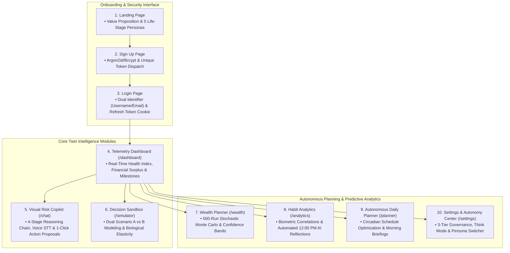
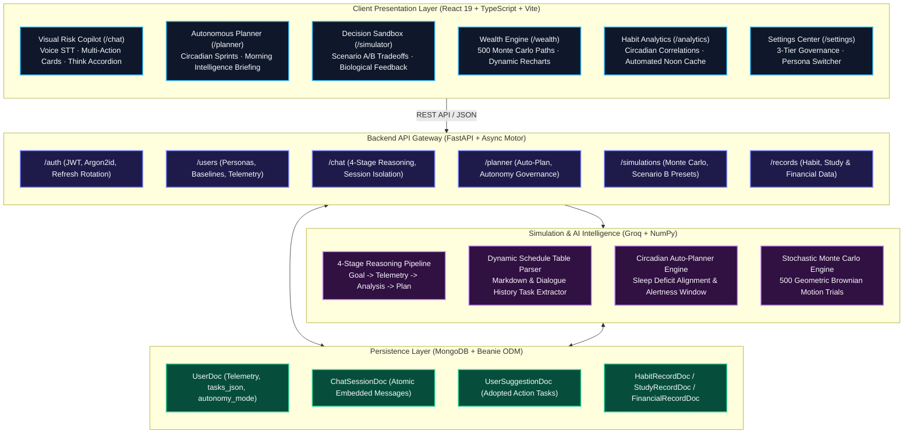
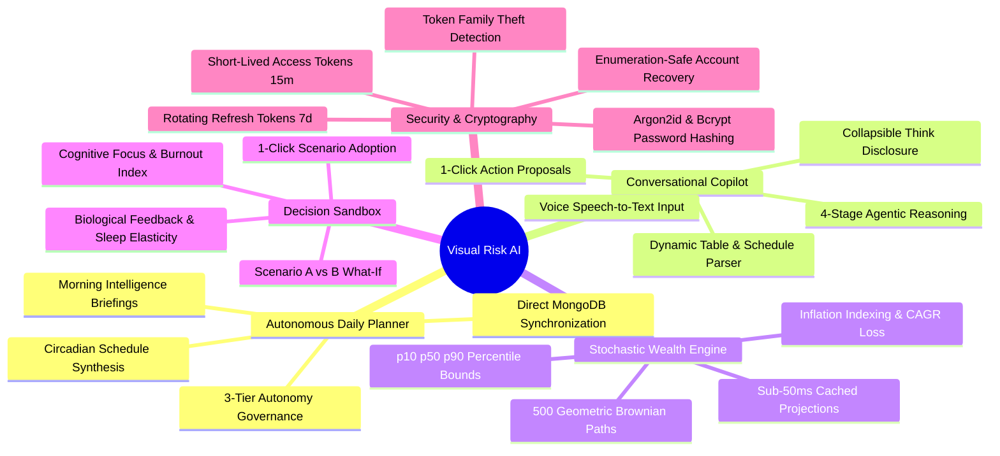
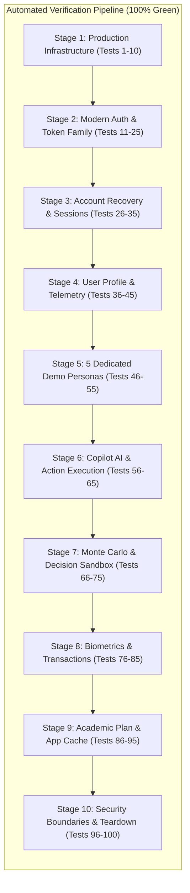

<p align="center">
  
</p>

<h1 align="center">Visual Risk AI</h1>

<p align="center">
  <b>AI-Based Visual Risk and Compliance Intelligence System (VRCI)</b><br />
  <i>Agentic Decision Intelligence · Circadian Biological Twins · Stochastic Monte Carlo Modeling · Autonomous AI Planner</i>
</p>

<p align="center">
  
</p>

<p align="center">
  Visual Risk AI (VRCI) is an agentic, intelligent risk, compliance, and decision-support system that models, forecasts, and optimizes trajectories across operational compliance, financial risk, health, cognitive performance, and daily habits. By combining stochastic Monte Carlo simulations, deterministic compound growth algorithms, biological circadian feedback models, and conversational agentic intelligence (Groq GPT-OSS 120B / 20B & Qwen 3.6), the platform creates a living digital twin tailored to the user's specific life stage.
</p>

---

## Interactive Visual Interface Tour



---

## System Architecture Overview



---

## Core Capabilities & Feature Highlights



---

## Complete Documentation Directory

- [**01. Core Capabilities**](docs/core_capabilities.md) — Comprehensive feature matrix, reasoning pipeline, and autonomy governance.
- [**02. The 5 User Personas**](docs/user_personas.md) — Detailed baseline metrics, circadian parameters, and goals for all 5 roles.
- [**03. System Architecture & Flowchart**](docs/system_architecture.md) — Detailed component interconnects, Mermaid diagrams, and data flow.
- [**04. Tech Stack & Engineering Architecture**](docs/tech_stack.md) — Frontend, backend, AI engine, and database stack specifications.
- [**05. Quickstart & Installation Guide**](docs/quickstart_guide.md) — Step-by-step installation, environment setup, and startup commands.
- [**06. Running the Application & Deployment**](docs/running_the_application.md) — Production build, docker deployment, and daemon process management.
- [**07. Complete API Reference & Example Payloads**](docs/api_reference.md) — Complete REST endpoint specifications, request schemas, and curl examples.
- [**08. Authentication & Security Architecture (15 Principles)**](docs/authentication_architecture.md) — Threat models, token lifecycles, and cryptographic standards.

---

## Step-by-Step Workflow Guides

1. [**01. System Architecture & Data Flow**](docs/workflow/01_system_architecture.md)
2. [**02. Onboarding & Persona Architecture**](docs/workflow/02_onboarding_and_personas.md)
3. [**03. Financial Forecasting & Monte Carlo Simulation**](docs/workflow/03_forecasting_and_monte_carlo.md)
4. [**04. Decision Sandbox & What-If Simulation**](docs/workflow/04_decision_sandbox_and_whatif.md)
5. [**05. Habit Analytics & Daily Noon Cache**](docs/workflow/05_habit_analytics_and_feedback.md)
6. [**06. Task Planner & Suggestion Adoption Engine**](docs/workflow/06_task_planner_and_suggestions.md)
7. [**07. Study & Productivity Intelligence**](docs/workflow/07_study_and_productivity_intelligence.md)
8. [**08. Visual Risk Copilot & Conversational Agent**](docs/workflow/08_digital_twin_copilot_chat.md)

---

## Exhaustive Verification & Test Coverage

The platform is backed by an automated 100-test end-to-end verification suite and complete pytest unit tests:



To execute the test suite:
```bash
# Run pytest unit tests (19/19 passing)
PYTHONPATH=. .venv/bin/pytest tests/

# Run complete 100 E2E tests (100/100 passing)
PYTHONPATH=. .venv/bin/python run_exact_100_e2e_tests.py

# Run live autonomous planner tests (8/8 passing)
PYTHONPATH=. .venv/bin/python test_live_autonomous_planner_e2e.py
```

---

*Visual Risk AI — Intelligent Multi-Persona Trajectory Engine.*
