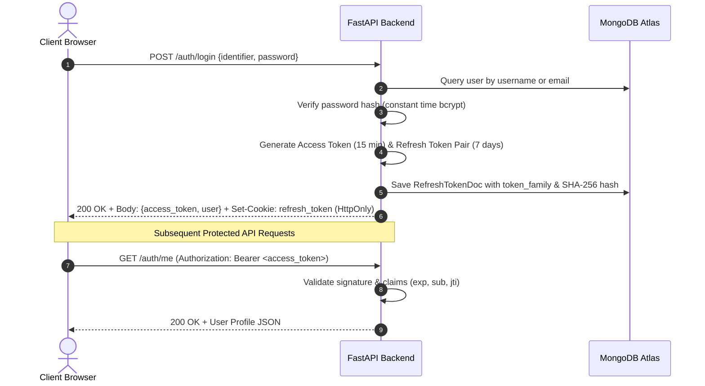
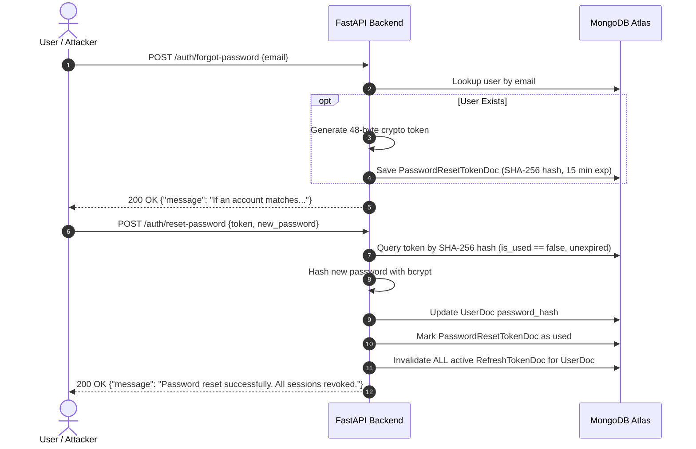
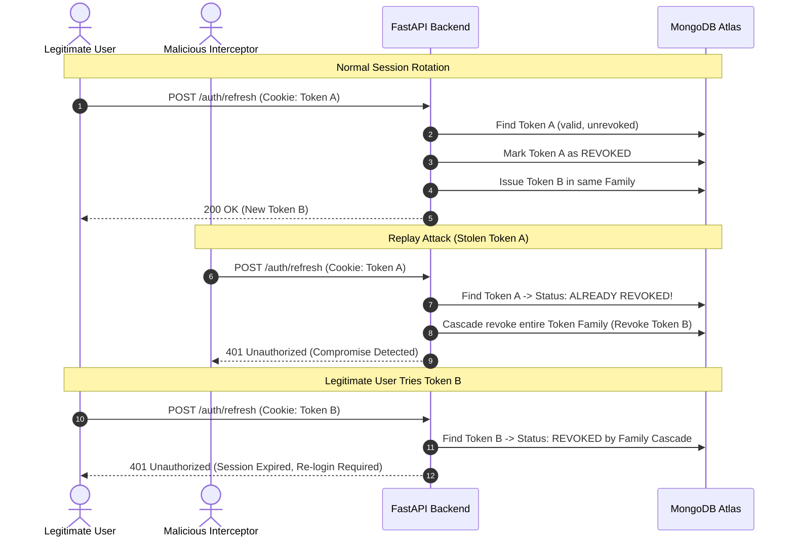
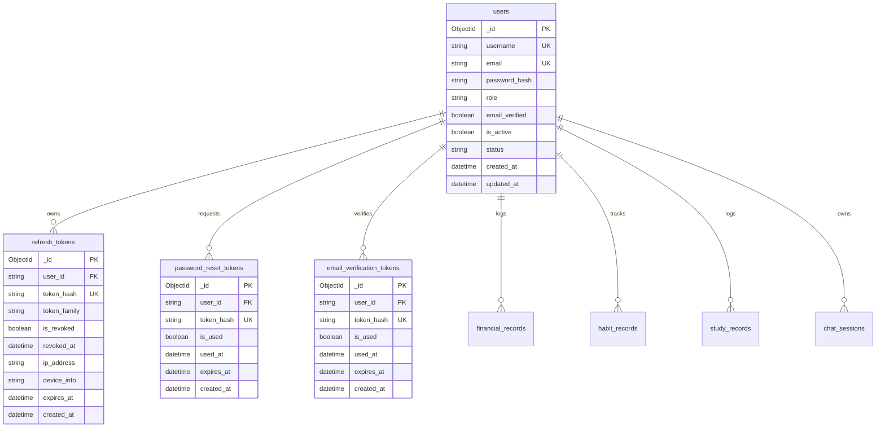

# Authentication and Security Architecture

## Overview

The AI-Based Visual Risk and Compliance Intelligence System employs a defense-in-depth security model built around 15 core architectural principles. This document outlines the cryptographic standards, token lifecycle, database schemas, authorization dependencies, and threat mitigation mechanisms governing the platform.

---

## 1. Authentication Model

The platform uses a hybrid token authentication model designed for secure Single Page Applications (SPAs) and API consumers:

* **Short-Lived Access Token (JWT)**: Valid for 15 minutes (`exp = iat + 900`). Used for all authenticated API requests. Retained in frontend memory.
* **Long-Lived Refresh Token**: Valid for 7 days (`expires_at = now + 7 days`). Transmitted strictly via an `HttpOnly; Secure; SameSite=Lax; Path=/` cookie to eliminate exposure to Cross-Site Scripting (XSS).
* **Single-Use Rotation**: Every time a refresh token is exchanged for a new access token, the presented refresh token is immediately revoked and replaced with a new one.



---

## 2. Password Security

* **Algorithm**: `bcrypt` (12 rounds) with cryptographically secure random salt generated per hash.
* **Safe Truncation**: Standard 72-byte safe boundary enforcement to avoid internal truncation anomalies.
* **Storage**: Passwords are never stored in plaintext or reversible formats. Stored exclusively as `password_hash` in the `users` MongoDB collection.
* **Verification**: Constant-time comparison prevents timing attacks.

```text
Plaintext Password
  |
  v
UTF-8 Encoding (max 72 bytes)
  |
  v
bcrypt.gensalt(rounds=12)
  |
  v
Stored in MongoDB users.password_hash: $2b$12$...
```

---

## 3. Sessions and Tokens

* **Access Token Payload**:
  * `sub`: MongoDB User Document ID (ObjectId string).
  * `role`: RBAC user role (`professional`, `student`, `freelancer`, `entrepreneur`, `retiree`, `admin`).
  * `username`: Account handle.
  * `email`: Verified or registered email.
  * `type`: Fixed value `"access"`.
  * `jti`: 128-bit cryptographic hex string ensuring per-token uniqueness.
  * `iat` / `exp`: Standardized UTC Unix timestamps.
* **Token Rotation with Family Tracking**: Refresh tokens belong to an immutable `token_family` (UUIDv4). When a token is refreshed, the new token inherits the family identifier.

---

## 4. Secure Storage

* **Access Token**: Stored in client memory (React state / closure). Never written to `localStorage` or `sessionStorage` where malicious third-party scripts could exfiltrate credentials.
* **Refresh Token**: Stored in an `HttpOnly` cookie with `SameSite=Lax` and `Path=/`. JavaScript running in the browser cannot read, inspect, or modify the cookie.
* **Database Storage**: Raw refresh tokens are never persisted in MongoDB. Only the SHA-256 digest (`hash_token(raw_token)`) is indexed and queried.

---

## 5. Login Security and User Enumeration Prevention

* **Generic Responses**: Failed login attempts return a uniform `401 Unauthorized` with the generic message `"Invalid username/email or password."` regardless of whether the identifier exists or the password is wrong.
* **Account Status Enforcement**: Deactivated or suspended accounts are rejected with `403 Forbidden` prior to session issuance.
* **Flexible Identifiers**: Users can authenticate using either their unique `username` or registered `email`.

---

## 6. Registration and Input Validation

* **Password Complexity**: Minimum length of 8 characters enforced at schema level via Pydantic v2.
* **Email Verification Token**: Registration automatically dispatches a 48-byte cryptographically secure single-use email verification token stored in `email_verification_tokens`.
* **Uniqueness Validation**: Prior to insertion, unique index checks guarantee no collision on `username` or `email`.

---

## 7. Password Reset and Session Invalidation

* **Generic Forgot Password**: `POST /auth/forgot-password` returns `"If an account matches this email, password reset instructions have been dispatched."` regardless of email presence.
* **Single-Use Cryptographic Tokens**: Reset tokens expire in 15 minutes and cannot be reused (`is_used: true`).
* **All-Device Session Revocation**: When a password reset or change occurs, all active `RefreshTokenDoc` records for that user are immediately marked `is_revoked: true`.



---

## 8. Multi-Factor Authentication (MFA) Readiness

The authentication router is built to accommodate TOTP (RFC 6238) and WebAuthn/FIDO2 credentials without breaking existing JWT session dependencies:

* User model includes `email_verified` boolean and extensible state flags.
* Single-use token infrastructure in MongoDB (`email_verification_tokens`) provides the foundation for step-up verification.

---

## 9. Authorization vs Authentication (RBAC)

Authentication verifies *who* the caller is; authorization determines *what* they can execute.

* **FastAPI Dependencies**:
  * `get_current_user`: Decodes JWT, validates signature, resolves user from MongoDB.
  * `get_current_active_user`: Confirms user is active and unsuspended.
  * `require_role(*roles)`: Enforces role permissions (e.g. `require_role("admin", "professional")`).

```python
@router.get("/admin/telemetry")
async def get_admin_telemetry(
    current_user: UserDoc = Depends(require_role("admin"))
):
    return {"status": "authorized", "user": current_user.username}
```

---

## 10. Do Not Trust Client-Provided Identity

All protected endpoints resolve the active user identity strictly from the verified JWT `sub` claim inside the authentication middleware:

* Endpoints do not rely on client-provided query parameters (`?user_id=123`) or request body headers for authorization decisions.
* Ownership is verified against the database before mutating or deleting chat sessions, records, or credentials.

---

## 11. Session Invalidation and Token Theft Detection

### Refresh Token Rotation and Cascade Revocation

If a stolen refresh token that has already been rotated is presented again (replay attack), the system detects the anomaly and immediately revokes all tokens belonging to that `token_family`:



### Logout Endpoints

* **`POST /auth/logout`**: Revokes the single active refresh token for the current device and deletes the cookie.
* **`POST /auth/logout-all`**: Revokes all refresh tokens across all devices belonging to the user.

---

## 12. Database Design



---

## 13. Security Infrastructure

* **CORS**: Explicit CORS middleware configuration controlling allowed origins, credentials, methods, and headers.
* **CSRF Mitigation**: `SameSite=Lax` cookie configuration ensures browser will not send the refresh token on cross-site requests.
* **NoSQL Injection Immunity**: Pydantic v2 schemas and Beanie ODM parameter binding sanitize all incoming payloads before query construction.

---

## 14. Secure Logging

* Plaintext passwords, raw JWT secrets, and unhashed refresh tokens are never outputted to console logs, log files, or ASGI error middleware.
* MongoDB connection strings mask passwords when reported in startup logs.

---

## 15. Threat Modeling and Mitigation Matrix

| Threat Vector | Potential Impact | Architecture Mitigation |
| :--- | :--- | :--- |
| **XSS Token Exfiltration** | Complete session hijack | Refresh token stored in `HttpOnly` cookie; Access token in memory only. |
| **Refresh Token Theft** | Persistent unauthorized API access | Automatic token rotation + Token Family Cascade Revocation on reuse. |
| **Replay Attacks** | Replay of old authentication payloads | Unique `jti` in JWT access tokens; Single-use refresh and reset tokens. |
| **User Enumeration** | Attacker maps registered emails | Generic responses for login and password reset endpoints. |
| **Credential Stuffing / Brute Force** | Account takeover via dictionary attack | `bcrypt` (12 rounds) high compute cost + account status validation. |
| **JWT Tampering** | Privilege escalation / role spoofing | Cryptographic HMAC-SHA256 signature verification with secret key. |
| **Stale Session Abuse** | Access retained after password change | Instant cascade invalidation of all user refresh tokens on password reset/change. |
