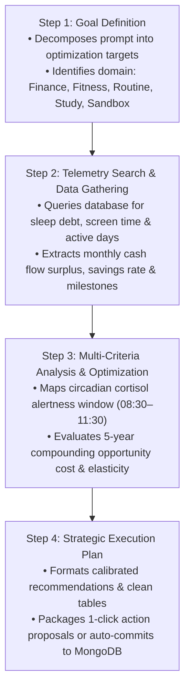
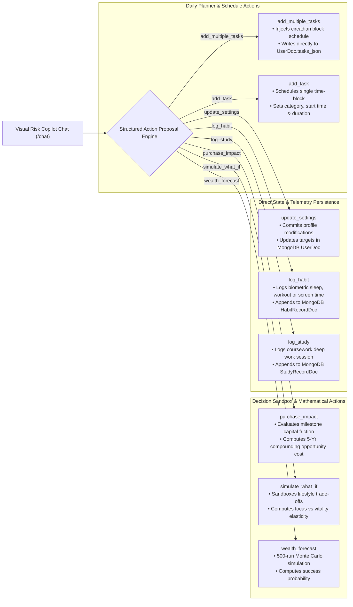
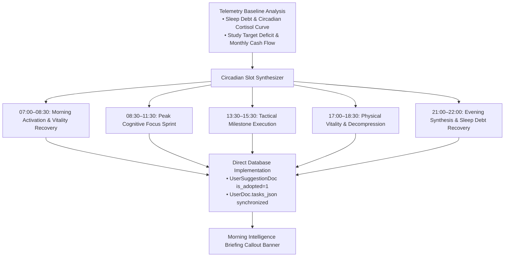
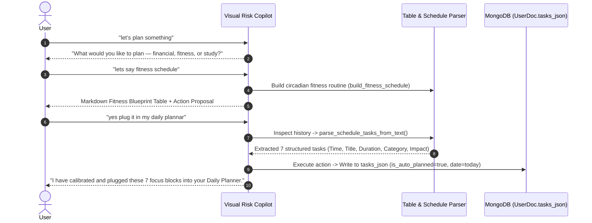

# Core Capabilities — Visual Risk AI

Visual Risk AI (VRCI) combines stochastic simulation models, biological circadian algorithms, deterministic compound growth engines, and conversational agentic intelligence into a living digital twin tailored to each user's unique life stage.

---

## 1. Visual Risk Copilot & Conversational Agent

The **Visual Risk Copilot** (`/chat`) is an autonomous conversational agent directly connected to the user's live profile, recent biometric logs, academic records, and financial ledger.

### 4-Stage Agentic Reasoning Pipeline

When a user submits a prompt (via text or Web Speech voice dictation), the system orchestrates a 4-stage problem-solving sequence:



### Real-Time Reasoning Disclosure (`<think>`)
The Copilot discloses its complete mathematical logic, boundary checks, and intermediate formulas inside collapsible `<think>` blocks. Users can verify assumptions, CAGR rates, inflation offsets, and circadian alertness curves in real time.

### Voice Input (Speech-to-Text)
Integrated Web Speech API dictation allows hands-free query submission with real-time waveform feedback and auto-formatting.

---

## 2. Interactive Multi-Action Execution Engine

Unlike passive chatbots, every recommendation generated by the Visual Risk Copilot includes an actionable execution card or auto-executes directly to MongoDB:



---

## 3. Autonomous AI Daily Planner & Morning Intelligence Briefings (`/planner`)

The system features an autonomous, proactive circadian planning engine (`ai_engine/auto_planner.py`) and dedicated REST endpoints (`/planner/auto-plan/{user_id}`) that synthesize and commit daily focus routines directly into MongoDB without requiring manual prompts.

### Circadian Schedule Optimization Architecture



### 3-Tier Autonomy Governance

Users configure their desired autonomy level in `/settings`:

```mermaid
stateDiagram-v2
  [*] --> Supervised: Default in strict environments
  [*] --> SemiAutonomous: Recommended default
  [*] --> FullAutonomous: Hands-free self-driving twin

  state Supervised {
    direction TB
    HumanInTheLoop: Human-in-the-loop governance
    ProposalsAwaitClick: AI generates proposal cards; tasks require 1-click user approval
  }

  state SemiAutonomous {
    direction TB
    AutoRoutines: Routine focus blocks, habit logs & study entries auto-commit directly
    ProtectedFinancials: Major financial deductions & profile shifts require confirmation
  }

  state FullAutonomous {
    direction TB
    SelfDrivingTwin: Morning schedules auto-plan on app startup
    ImmediateWrite: All conversational planning turns immediately write to MongoDB
  }
```

---

## 4. Dynamic Schedule Table & Multi-Turn Dialogue Parser

When users discuss routines or schedules in chat (e.g. *"let's plan something"* -> *"lets say fitness schedule"* -> *"yes plug it in my daily plannar"*), the AI parsing engine dynamically extracts structured tasks across dialogue turns:



---

## 5. Financial Twin & Monte Carlo Forecasting (`/wealth`)

- **500-Iteration Stochastic Volatility Modeling**: Models portfolio growth using Geometric Brownian Motion with log-normal asset returns ($\mu = 8\%$, $\sigma = 15\%$) and annual inflation indexing ($2.5\%$).
- **Percentile Confidence Bands**: Computes 10th percentile (Bear Market floor), 50th percentile (Median Trajectory), and 90th percentile (Bull Market ceiling) horizons.
- **Adaptive Multi-Scale Visualizations**: Recharts engine with dynamic Y-axis scaling that gracefully handles student allowances in hundreds of dollars to venture equity and retirement reserves in millions.
- **Intelligent Prediction Cache**: Caches heavy simulation runs in `app_cache` MongoDB collection to deliver sub-50ms render latency.

---

## 6. Decision Sandbox & What-If Simulator (`/simulator`)

- **Side-by-Side Scenario Modeling**: Real-time evaluation of competing lifestyle paths (Scenario A vs. Scenario B).
- **Multi-Variable Tradeoff Engine**: Analyzes tradeoffs between sleep duration, screen time, study intensity, and monthly savings.
- **Biological Feedback**: Computes Health Score, Cognitive Focus Score, and Burnout Risk.
- **1-Click Adoption**: Seamlessly applies winning scenario parameters directly to your live profile.

---

## 7. Universal Habit Analytics & Daily Reflection Cache (`/analytics`)

- **Grouped Correlation Visualizations**: Multi-axis telemetry charts comparing Sleep vs. Focus, Screen Time vs. Mood, and Exercise vs. Vitality.
- **Automated Noon AI Reflection Cache**: Automatically evaluates habit logs at 12:00 PM local time to generate fresh daily reflections with automatic cache invalidation.

---

## 8. Robust Authentication & Session Security (`/auth` & `/users`)

- **Unified Multi-Identifier Login**: Seamless authentication supporting either registered email address or username.
- **Cryptographic Password Hashing**: `bcrypt` (12 rounds) with safe 72-byte boundary checks and constant-time verification.
- **Short-Lived Access Tokens & Rotating Refresh Cookies**: 15-minute JWT access tokens in memory and 7-day `HttpOnly; SameSite=Lax; Secure` refresh cookies with token family theft detection.
- **Single-Use Cryptographic Password Resets**: Enumeration-safe dispatch and instant session invalidation.
- **Session Ownership Isolation**: Chat threads, message histories, and action executions enforce strict user ownership verification (403 Forbidden on mismatch).

---

*Back to [README.md](../README.md)*
