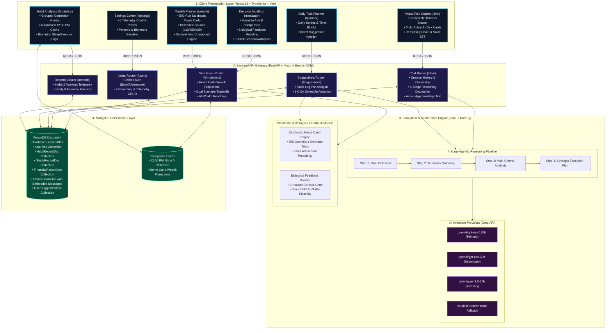
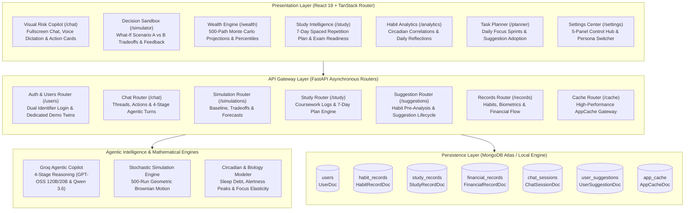

# System Architecture — Visual Risk AI

Visual Risk AI (VRCI) is engineered as a decoupled, multi-tier reactive architecture combining a high-performance React 19 frontend client, an asynchronous FastAPI backend gateway, a vectorized mathematical simulation engine, and an agentic LLM inference pipeline powered by MongoDB document persistence.

---

## High-Level Architecture Flowchart

---

## Subsystem Component Interconnect Diagram

---

*Back to [README.md](../README.md)*
