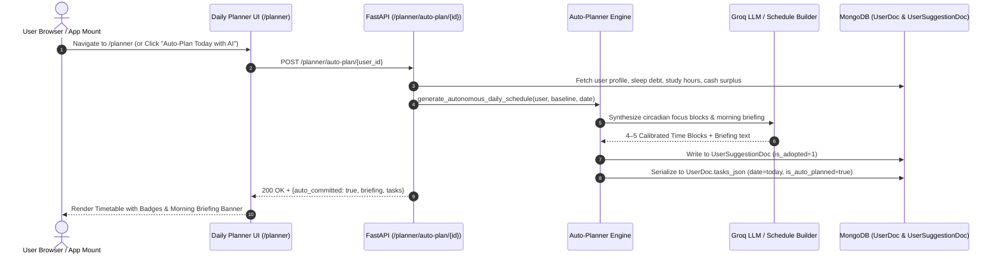
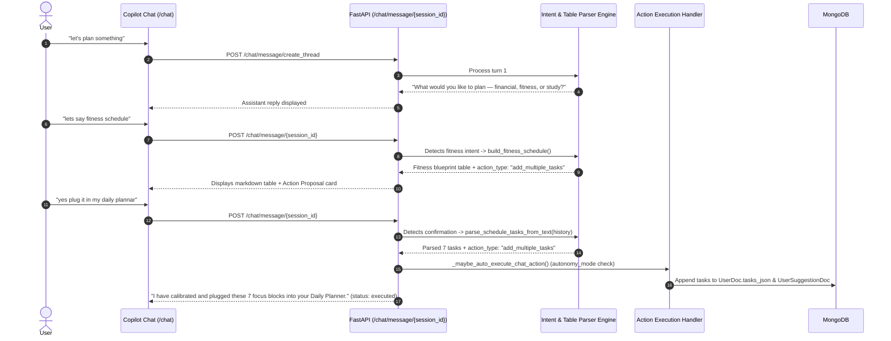
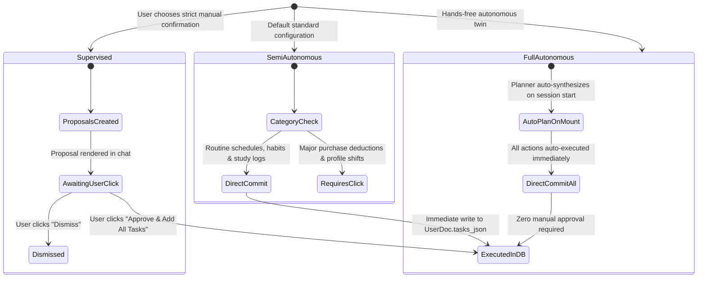
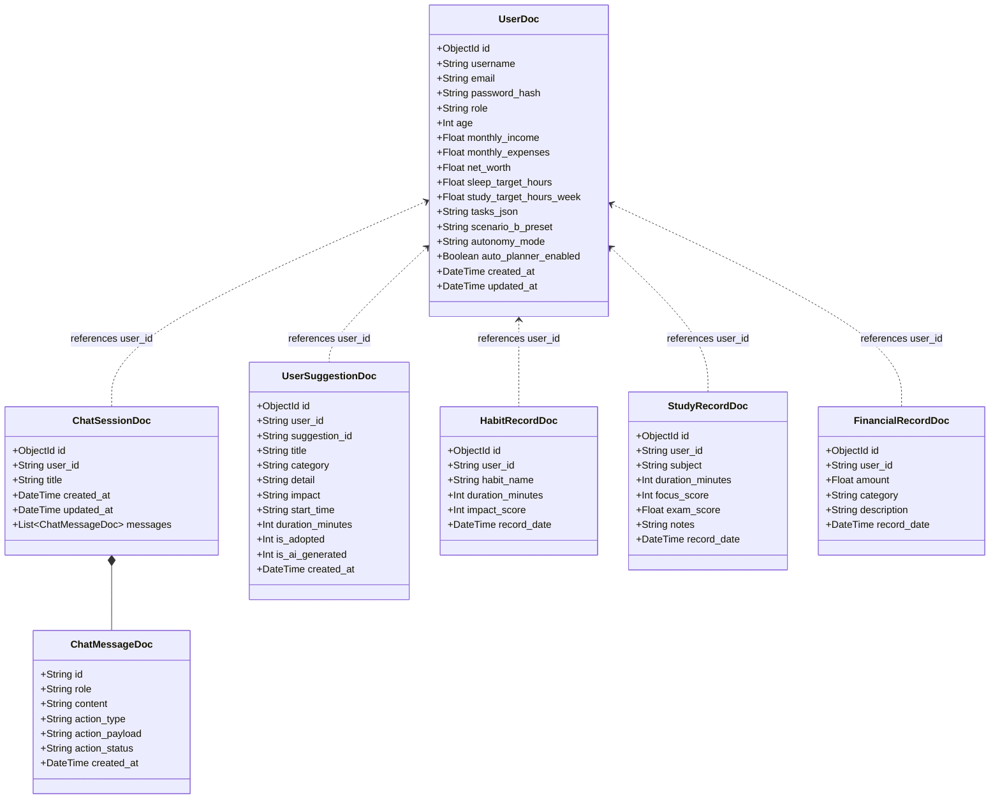
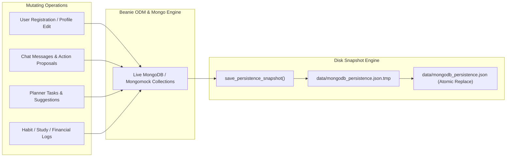

# System Architecture — Visual Risk AI

Visual Risk AI (VRCI) is engineered as a decoupled, multi-tier reactive architecture combining a high-performance React 19 frontend client, an asynchronous FastAPI backend gateway, a vectorized mathematical simulation engine, an agentic LLM inference pipeline with dynamic table parsing, and an autonomous circadian daily planner backed by MongoDB document persistence.

---

## 1. High-Level Architecture Flowchart

```mermaid
flowchart TB
    %% Styling Classes
    classDef clientStyle fill:#0f172a,stroke:#38bdf8,stroke-width:2px,color:#f8fafc;
    classDef gatewayStyle fill:#1e1b4b,stroke:#818cf8,stroke-width:2px,color:#f8fafc;
    classDef aiStyle fill:#311042,stroke:#c084fc,stroke-width:2px,color:#f8fafc;
    classDef dbStyle fill:#064e3b,stroke:#34d399,stroke-width:2px,color:#f8fafc;

    subgraph Client["1. Client Presentation Layer (React 19 + TypeScript + Vite)"]
        Chat["Visual Risk Copilot (/chat)<br/>• Collapsible Threads Drawer<br/>• Multi-Action 1-Click Cards<br/>• Reasoning Chain & Voice STT"]:::clientStyle
        Planner["Autonomous Daily Planner (/planner)<br/>• Circadian Time Blocks<br/>• Morning Intelligence Briefing<br/>• Auto-Plan Today with AI"]:::clientStyle
        Simulator["Decision Sandbox (/simulator)<br/>• Scenario A vs B Comparison<br/>• Biological Feedback Modeling<br/>• 1-Click Scenario Adoption"]:::clientStyle
        Wealth["Wealth Planner (/wealth)<br/>• 500-Run Stochastic Monte Carlo<br/>• Percentile Bounds (p10/p50/p90)<br/>• Deterministic Compound Engine"]:::clientStyle
        Analytics["Habit Analytics (/analytics)<br/>• Grouped Correlation Visuals<br/>• Automated 12:00 PM Cache<br/>• Biometric Sleep/Exercise Logs"]:::clientStyle
        Settings["Settings Center (/settings)<br/>• 3-Tier Governance Controls<br/>• Persona & Biometric Baseline"]:::clientStyle
    end

    subgraph Gateway["2. Backend API Gateway (FastAPI + Motor + Beanie ODM)"]
        AuthRouter["Auth Router (/auth)<br/>• Argon2id/Bcrypt Hashing<br/>• JWT + Rotating Refresh Cookie<br/>• Token Family Replay Protection"]:::gatewayStyle
        UserRouter["Users Router (/users)<br/>• Unified Auth (Email/Username)<br/>• Onboarding & Telemetry CRUD"]:::gatewayStyle
        ChatRouter["Chat Router (/chat)<br/>• Session History & Ownership<br/>• 4-Stage Reasoning Dispatcher<br/>• Action Auto-Execution"]:::gatewayStyle
        PlanRouter["Planner Router (/planner)<br/>• Autonomous Schedule Synthesis<br/>• Autonomy Mode Governance<br/>• Status & Briefings"]:::gatewayStyle
        SimRouter["Simulation Router (/simulations)<br/>• Monte Carlo Wealth Projections<br/>• Dual Scenario Tradeoffs<br/>• AI Wealth Roadmap"]:::gatewayStyle
        SugRouter["Suggestions Router (/suggestions)<br/>• Habit Log Pre-Analysis<br/>• 1-Click Schedule Adoption"]:::gatewayStyle
        RecRouter["Records Router (/records)<br/>• Habit & Workout Telemetry<br/>• Study & Financial Records"]:::gatewayStyle
    end

    subgraph Intelligence["3. Simulation & AI Inference Engine (Groq + NumPy)"]
        subgraph Pipeline["4-Stage Agentic Reasoning Pipeline"]
            Step1["Step 1: Goal Definition"] --> Step2["Step 2: Telemetry Gathering"]
            Step2 --> Step3["Step 3: Multi-Criteria Analysis"]
            Step3 --> Step4["Step 4: Strategic Execution Plan"]
        end

        subgraph AutoPlanningAndParsing["Autonomous Planning & Table Parser"]
            AutoPlanEngine["Autonomous Daily Planner<br/>• Sleep Deficit Compensation<br/>• Circadian Peak Alignment (08:30-11:30)"]
            TableParser["Dynamic Table & List Parser<br/>• Markdown Table Row Extractor<br/>• Dialogue History Parser"]
            ScheduleBuilder["Circadian Schedule Builder<br/>• Smart Role / Fitness / Study Sprints"]
        end

        subgraph MathModels["Stochastic & Biological Feedback Models"]
            MonteCarlo["Stochastic Monte Carlo Engine<br/>• 500 Geometric Brownian Trials<br/>• Goal Attainment Probability"]
            BioFeedback["Biological Feedback Modeler<br/>• Circadian Cortisol Alerts<br/>• Sleep Debt & Vitality Elasticity"]
        end

        subgraph LLMProviders["AI Inference Providers (Groq API)"]
            Groq120B["openai/gpt-oss-120b (Primary)"]:::aiStyle
            Groq20B["openai/gpt-oss-20b (Secondary)"]:::aiStyle
            GroqQwen["qwen/qwen3.6-27b (Auxiliary)"]:::aiStyle
            OfflineRule["Heuristic Deterministic Fallback"]:::aiStyle
        end
    end

    subgraph Persistence["4. MongoDB Persistence Layer"]
        DB[(MongoDB Document Database: Local / Atlas<br/>• UserDoc Collection (telemetry, tasks_json, autonomy_mode)<br/>• HabitRecordDoc Collection<br/>• StudyRecordDoc Collection<br/>• FinancialRecordDoc Collection<br/>• ChatSessionDoc with Embedded Messages<br/>• UserSuggestionDoc Collection)]:::dbStyle
        Cache[(Intelligence Cache<br/>• 12:00 PM Noon AI Reflection<br/>• Monte Carlo Wealth Projections)]:::dbStyle
    end

    %% Connections
    Chat -->|REST / JSON| ChatRouter
    Planner -->|REST / JSON| PlanRouter
    Simulator -->|REST / JSON| SimRouter
    Wealth -->|REST / JSON| SimRouter
    Analytics -->|REST / JSON| RecRouter
    Settings -->|REST / JSON| UserRouter

    ChatRouter --> Pipeline
    Pipeline --> TableParser
    Pipeline --> LLMProviders
    PlanRouter --> AutoPlanEngine
    AutoPlanEngine --> ScheduleBuilder
    AutoPlanEngine --> LLMProviders
    SimRouter --> MathModels

    AuthRouter <--> DB
    UserRouter <--> DB
    ChatRouter <--> DB
    PlanRouter <--> DB
    SimRouter <--> DB
    RecRouter <--> DB
    SimRouter <--> Cache
    Analytics <--> Cache
```

---

## 2. Autonomous Daily Planning & Circadian Execution Flowchart



---

## 3. Multi-Turn Dialogue & Dynamic Table Extraction Flowchart



---

## 4. 3-Tier Autonomy Governance State Machine



---

## 5. MongoDB Document Models (Beanie ODM)



---

## 6. Local Disk Persistence Engine & State Rehydration

To guarantee durability and zero data loss across user logouts, account switches, and server restarts, Visual Risk AI integrates a synchronous disk persistence snapshot engine:



### Key Architectural Capabilities:
1. **Tutorial Thread Auto-Seeding**: Every new profile eagerly receives the standard "Tutorial" thread with interactive onboarding guidance.
2. **Deterministic Startup Rehydration**: On application startup, `load_persistence_snapshot()` populates all document collections before network requests are served.
3. **Lossless Conversation State**: Chat messages, proposed action payloads, execution statuses, and multi-turn planner history persist across sessions.

---

*Back to [README.md](../README.md)*
