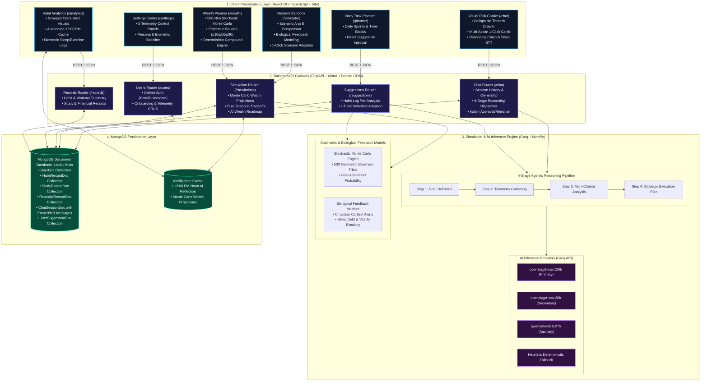

# System Architecture — Visual Risk AI

Visual Risk AI (VRCI) is engineered as a decoupled, multi-tier reactive architecture combining a high-performance React 19 frontend client, an asynchronous FastAPI backend gateway, a vectorized mathematical simulation engine, and an agentic LLM inference pipeline powered by MongoDB document persistence.

---

## High-Level Architecture Flowchart

---

## Component Breakdown Table

| Architectural Layer | Subsystem / Module | Primary Responsibilities | Data Handled | Core Technologies |
| :--- | :--- | :--- | :--- | :--- |
| **Presentation Layer** | **Visual Risk Copilot (`/chat`)** | Fullscreen conversational interface with collapsible sessions drawer, multi-action 1-click execution cards, reasoning disclosure (`<think>`), and voice dictation. | Session IDs, prompt streams, action proposals, status updates | React 19, TypeScript, Radix UI, Lucide Icons, Web Speech API |
| | **Decision Sandbox (`/simulator`)** | Interactive side-by-side lifestyle scenario comparison (Scenario A vs B), biological feedback modeling, and 1-click parameter adoption. | Sleep targets, study hours, monthly savings, burnout indices | Recharts, Radix Sliders, Tailwind CSS |
| | **Wealth Engine (`/wealth`)** | 500-path stochastic Monte Carlo simulation visualization, deterministic compound growth curves, and percentile probability estimation. | Net worth, savings surplus, CAGR, asset volatility bounds | Recharts Multi-Scale Charts, Pydantic DTOs |
| | **Habit Analytics (`/analytics`)** | Biometric habit tracking, grouped correlation charts, and automated noon daily reflection card display. | Sleep, screen time, exercise days, mood rating | Recharts, LocalStorage Cache |
| | **Task Planner (`/planner`)** | Daily focus schedule management, time-blocking, habit injection, and recommendation adoption workflow. | Tasks, time slots, completion states, categories | Radix UI, TanStack Router |
| | **Settings Center (`/settings`)** | Multi-panel telemetry control center for persona switching, biometrics, financial goals, and AI parameters. | User profiles, slider presets, onboarding status | Radix Tabs, React Hook Form |
| **API Gateway Layer** | **FastAPI Application Router** | Validates payloads via Pydantic v2, enforces session ownership security, and orchestrates services. | JSON Request/Response schemas, HTTP status codes | FastAPI, Uvicorn, Pydantic v2 |
| | **Authentication & CRUD Router (`/users`)** | Enforces username/email uniqueness, supports dual identifier login, and persists onboarding state. | User credentials, demographic baselines, targets | Motor Async Client, Beanie ODM |
| | **Chat & Action Router (`/chat`)** | Manages conversation threads, dispatches prompts to the 4-stage pipeline, and handles action approvals/rejections. | Message history, action payloads, tool invocations | REST Endpoints, Custom Event Dispatchers |
| | **Simulation Router (`/simulations`)** | Triggers Monte Carlo wealth projections, scenario tradeoff comparisons, and AI wealth roadmap generation. | Stochastic parameters, scenario vectors, advice text | NumPy, Pandas, Scipy |
| | **Suggestion Router (`/suggestions`)** | Evaluates habit log pre-analysis, generates tailored routine adjustments, and manages database adoption. | Suggestion records, adoption flags, difficulty | Heuristic Rule Engine, Groq LLM |
| **Intelligence Layer** | **Agentic Reasoning Pipeline** | 4-stage problem decomposition: (1) Goal Definition, (2) Telemetry Search, (3) Optimization Analysis, (4) Structured Markdown/Action Output. | Database telemetry bundles, prompt context | Groq API (`gpt-oss-120b`, `gpt-oss-20b`, `qwen3.6-27b`) |
| | **Stochastic Simulation Engine** | Geometric Brownian Motion mathematical model running 500 volatility paths with inflation adjustments. | Mean return, variance, annual savings rate, time horizons | NumPy Vectorized Computations |
| | **Circadian & Biological Modeler** | Calculates acute sleep debt, cortisol alertness peaks (09:00–11:30), post-prandial dips, and focus elasticity. | Biometric logs, target variances, fatigue indices | Heuristic Mathematical Models |
| **Persistence Layer** | **MongoDB Document Database** | NoSQL document storage for users, biometric logs, academic records, transactions, and chat sessions with embedded messages. | BSON Document Collections, Unique Indexes | MongoDB (Local / Atlas), Motor Async, Beanie ODM |
| | **Intelligence & Cache Layer** | Caches computationally expensive Monte Carlo trials and daily noon AI reflections to guarantee sub-50ms render latency. | Forecast bundles, daily summaries, timestamped keys | Document Sub-fields / In-Memory Cache |

---

*Back to [README.md](../README.md)*
