# System Architecture — Visual Risk AI

Visual Risk AI is engineered as a decoupled, multi-tier architecture combining a React frontend, FastAPI backend, AI inference pipeline, mathematical simulation engine, autonomous planner, and MongoDB persistence layer.

---

## 1. High-Level Architecture Flowchart

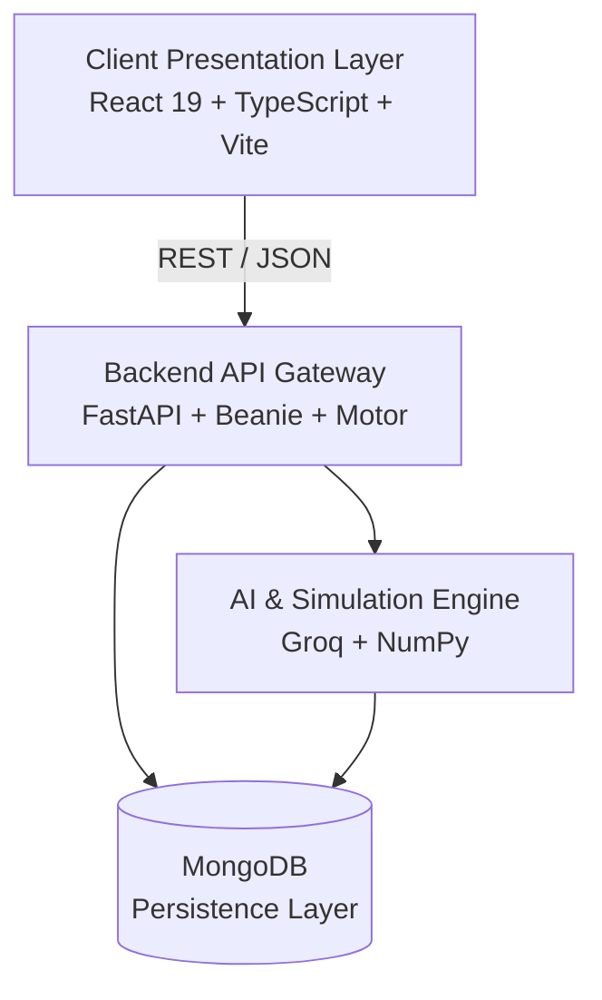

### Main Components

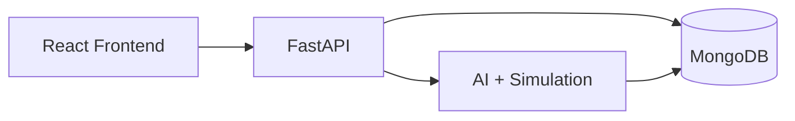

---

## 2. Autonomous Daily Planning & Circadian Execution Flowchart

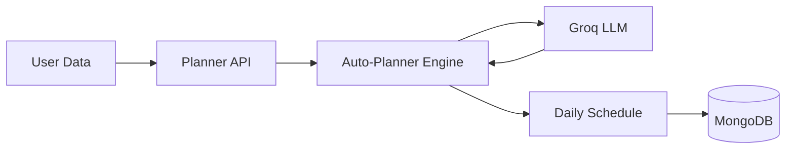

---

## 3. Multi-Turn Dialogue & Dynamic Table Extraction Flowchart

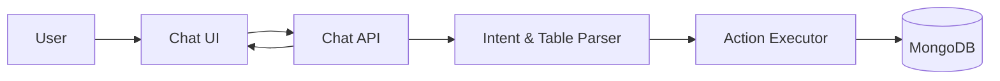

### 3.1 Direct Natural-Language Chat Mutation Sequence

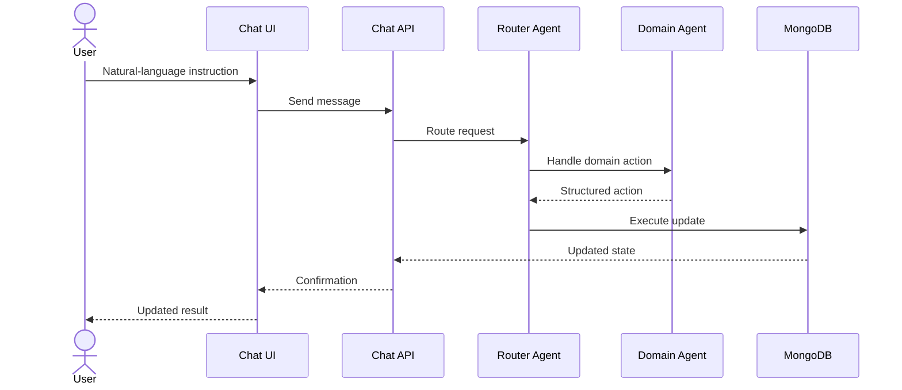

---

## 4. 3-Tier Autonomy Governance State Machine

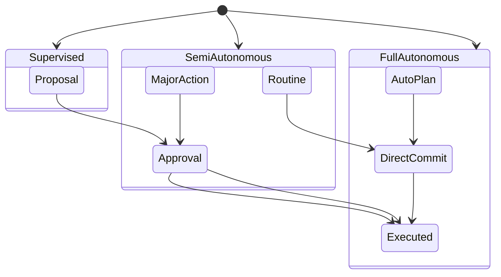

### Autonomy Model

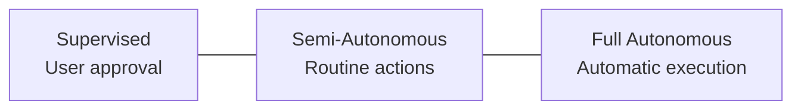

---

## 5. MongoDB Document Models

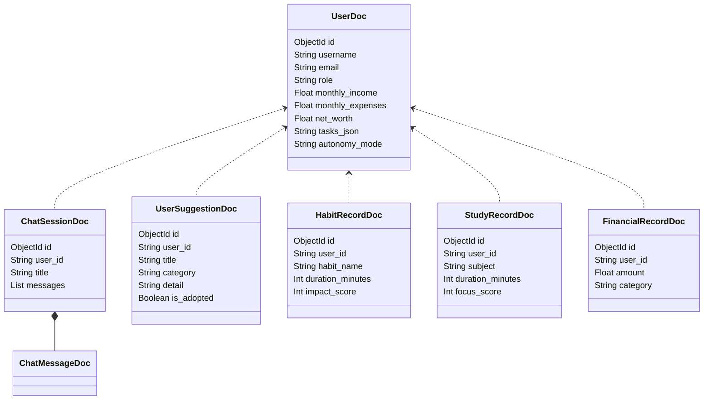

---

## 6. Local Disk Persistence Engine & State Rehydration

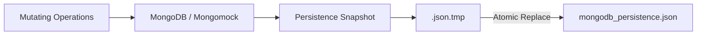

### Startup Recovery

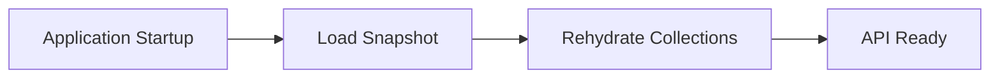

---

## Architecture Flow Summary

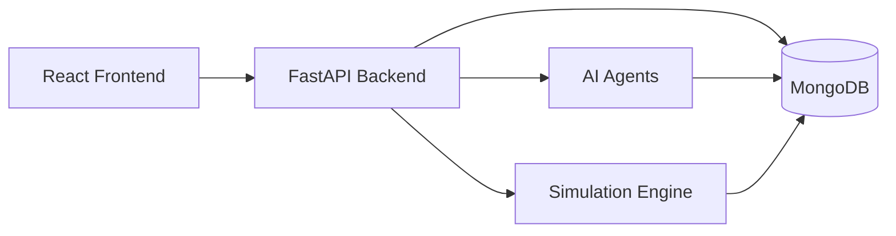

### Key Architectural Capabilities

1. **Tutorial Thread Auto-Seeding**: Every new profile receives the standard Tutorial thread.
2. **Deterministic Startup Rehydration**: Persistence snapshots are loaded before network requests are served.
3. **Lossless Conversation State**: Chat messages, action payloads, execution statuses, and planner history persist across sessions.

*Back to [README.md](../README.md)*
