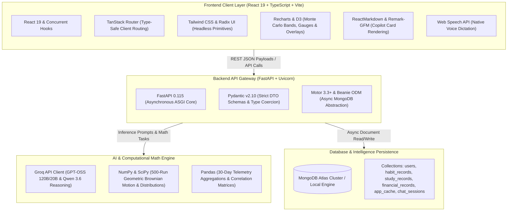

# Tech Stack & Engineering Architecture — Visual Risk AI

Visual Risk AI is constructed with a modern, type-safe stack designed for sub-50ms rendering performance, mathematical rigor, and responsive reactivity.

---

## Technology Architecture & Layer Breakdown

---

## Frontend Package Directory
- `@radix-ui/react-dropdown-menu`: Header conversation switcher and options menus.
- `@radix-ui/react-slider`: Multi-parameter tradeoff sandboxing sliders.
- `@radix-ui/react-tabs`: Telemetry panel switching in Settings and Overview.
- `lucide-react`: Official icon set (including `GaugeCircle`, `TrendingUp`, `Bot`, `Activity`).
- `sonner`: Floating real-time notification toasts for database sync events.

---

## Backend Architectural Highlights
- **Stateless Async Services**: Request handlers run asynchronously over Uvicorn workers with non-blocking I/O.
- **Asynchronous Document Persistence**: Powered by Motor and Beanie ODM for scalable NoSQL storage across users, telemetry records, chat sessions, and AI suggestion states.
- **Dynamic Context Building**: The AI engine dynamically aggregates 30-day baseline statistics into concise telemetry bundles before prompting Groq.
- **Fail-Safe Mathematical Fallbacks**: In the event of network timeouts, mathematical simulations seamlessly fallback to deterministic compound and heuristic models.

---

*Back to [README.md](../README.md)*
