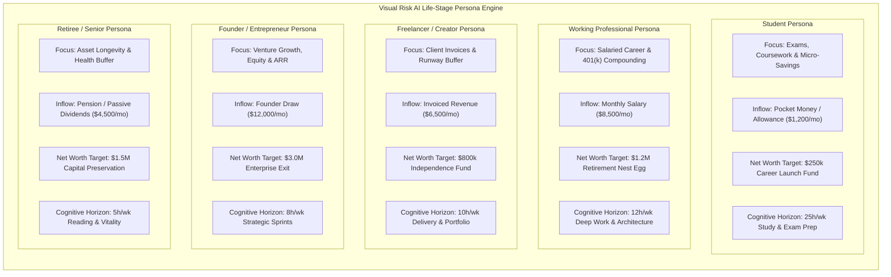
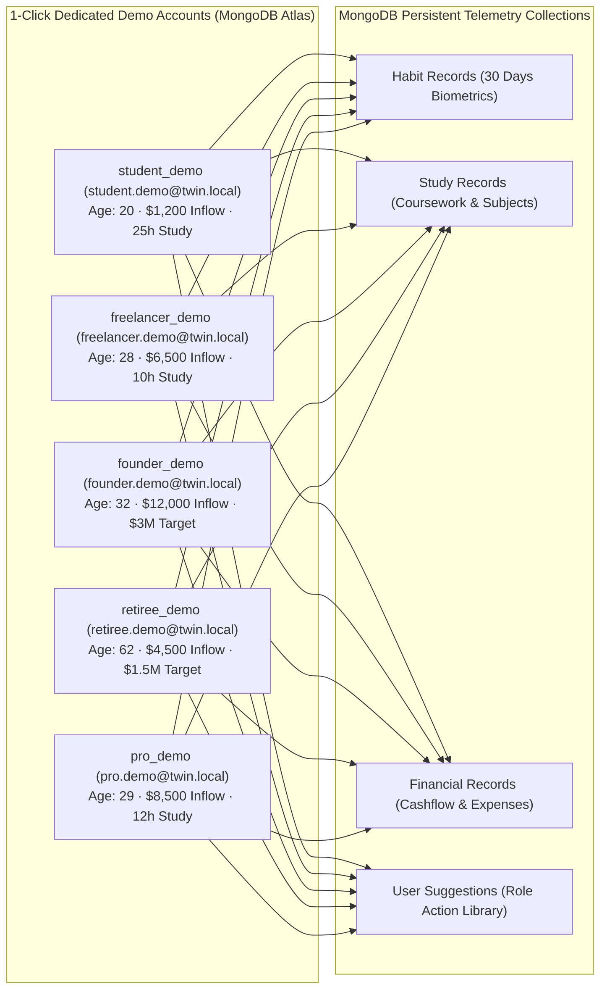

# The 5 User Personas — Visual Risk AI

Visual Risk AI adapts its financial models, habit baselines, circadian schedules, and AI reasoning algorithms across 5 distinct life-stage personas.

---

## Persona Comparison Architecture

---

## In-Depth Persona Profiles

### 1. Student Persona
- **Demographics**: Ages 18–24, pursuing academic degrees, certifications, or early vocational training.
- **Financial Architecture**: Optimized for allowance budgets, micro-savings, and minimizing student debt friction.
- **Circadian Schedule**: Heavy emphasis on study session time-blocking, spaced repetition scheduling, and exam preparation sprint windows.
- **Default Targets**:
  - Sleep Target: 8.0 hours/night
  - Study Target: 25.0 hours/week
  - Monthly Allowance: $1,200.00
  - Target Career Launch Fund: $250,000.00 by age 60

### 2. Working Professional Persona
- **Demographics**: Ages 25–55, full-time employment, climbing career tracks, managing 401(k) / equity portfolios.
- **Financial Architecture**: Focuses on maximizing monthly savings rate (target > 35%), automated surplus investment sweeps, and compounding wealth trajectory to age 58.
- **Circadian Schedule**: Protects 08:30–11:30 AM circadian cortisol alertness peaks for deep work, mitigating evening cognitive fatigue.
- **Default Targets**:
  - Sleep Target: 7.5 hours/night
  - Study / Upskilling Target: 12.0 hours/week
  - Monthly Salary: $8,500.00
  - Target Retirement Net Worth: $1,200,000.00 by age 58

### 3. Freelancer / Creator Persona
- **Demographics**: Independent contractors, creative studio owners, and software consultants managing variable income streams.
- **Financial Architecture**: Prioritizes liquid emergency runway (6–12 months expenses buffer) and tax-efficient quarterly reserves.
- **Circadian Schedule**: Flexible work-block scheduling, preventing digital screen burnout and irregular sleep patterns.
- **Default Targets**:
  - Sleep Target: 7.5 hours/night
  - Deep Work Target: 10.0 hours/week
  - Average Invoiced Revenue: $6,500.00
  - Target Financial Independence Fund: $800,000.00 by age 55

### 4. Founder / Entrepreneur Persona
- **Demographics**: Venture founders, agency owners, and startup operators balancing rapid execution with high operational stress.
- **Financial Architecture**: Focuses on company runway survival, founder draw sustainability, and long-term equity valuation horizons.
- **Circadian Schedule**: Aggressively mitigates acute sleep debt to sustain high-stakes decision-making and executive focus.
- **Default Targets**:
  - Sleep Target: 6.5 hours/night
  - Strategic Sprint Target: 8.0 hours/week
  - Founder Draw: $12,000.00
  - Target Enterprise Valuation / Exit: $3,000,000.00 by age 50

### 5. Retiree / Senior Persona
- **Demographics**: Ages 55+, individuals in retirement or phased transition, focusing on asset preservation and health longevity.
- **Financial Architecture**: Safe withdrawal rate modeling (3.5%–4.0%), inflation-adjusted passive income streams, and healthcare risk buffers.
- **Circadian Schedule**: Structured daily walking, restorative sleep consistency, cognitive vitality exercises, and stress minimization.
- **Default Targets**:
  - Sleep Target: 8.0 hours/night
  - Reading / Vitality Activity: 5.0 hours/week
  - Monthly Pension / Dividends: $4,500.00
  - Capital Preservation Target: $1,500,000.00 to age 65+

---

## Dedicated MongoDB Demo Twin Accounts

To support instant, 1-click exploration with realistic multi-week history without requiring manual registration, Visual Risk AI automatically initializes dedicated, isolated demo documents in MongoDB Atlas (`GET /users/demo/{role}`):

Each demo persona maintains isolated simulation presets, AI reasoning history, and telemetry logs directly in MongoDB Atlas.

---

*Back to [README.md](../README.md)*
