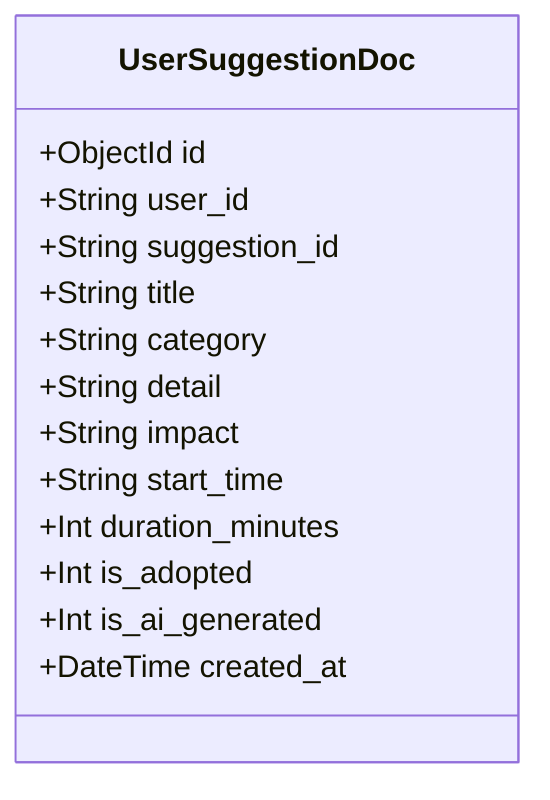
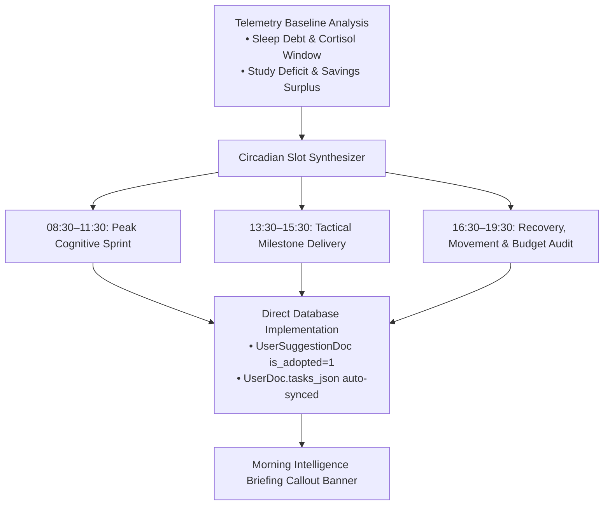

# Workflow Step 6: Task Planner & Smart Suggestions Engine

This document details the role-adapted daily task planner (`/planner`), the data-driven smart suggestions intelligence engine (`/suggestions`), database persistence, and one-click task scheduling.

---

## 1. Role-Tailored Task Categories

The task planner dynamically filters and organizes categories based on the user's active persona:

- **Student**: `["Study", "Exams", "Campus", "Money", "Health", "Social"]`
- **Working Professional**: `["Work", "Career", "Finance", "Health", "Upskilling", "Personal"]`
- **Freelancer / Creator**: `["Client Work", "Projects", "Invoices", "Admin", "Health", "Upskilling"]`
- **Founder / Entrepreneur**: `["Product", "Growth", "Fundraising", "Operations", "Team", "Health"]`
- **Retiree / Senior**: `["Health", "Hobbies", "Finance", "Family", "Home", "Leisure"]`

---

## 2. Smart AI Suggestion Engine (`/suggestions`)

The suggestions engine performs deep data pre-analysis before synthesizing personalized lifestyle, focus, and financial suggestions.

### A. Pre-Analysis Pipeline
Before calling the LLM, the backend analyzes:
1. **Active Role Persona**: Adapts expectations (e.g. Student allowance vs Founder equity runways).
2. **30-Day Measured Baseline**:
   - Sleep averages (detects sleep debt $<7.0$h vs restorative $>8.0$h).
   - Screen time load (identifies digital fatigue $>5.0$h/day).
   - Study & focus hours (assesses consistency vs cramming).
   - Daily active movement & mood scores.
3. **Financial Milestone Targets**: Evaluates current net worth vs retirement/milestone target.
4. **Lifestyle Bottlenecks**: Automatically formulates concise diagnostic callouts that guide the generation prompt.

---

## 3. Database Persistence (`UserSuggestionDoc`)

Suggestions are stored in MongoDB via the `UserSuggestionDoc` Beanie document model, ensuring custom recommendations and adoption states persist across sessions:

---

## 6. Autonomous AI Daily Planner & Self-Implementation Engine

The system features an autonomous, proactive circadian planning engine (`ai_engine/auto_planner.py`) and dedicated REST endpoints (`/planner/auto-plan/{user_id}`) that synthesize and commit daily focus routines directly into MongoDB without requiring manual prompts.

### A. Circadian Optimization Architecture

### B. 3-Tier Autonomy Governance

Users configure their desired autonomy level in `/settings`:

| Autonomy Mode | Description | Direct DB Execution |
| :--- | :--- | :--- |
| **`supervised`** | Human-in-the-loop: Copilot generates proposal cards awaiting 1-click user approval. | Requires user click |
| **`semi_autonomous`** | Recommended Default: Routine schedules, habit entries, and study sessions auto-commit directly; major financial deductions require approval. | Auto for routines & logs |
| **`full_autonomous`** | Self-Driving Twin: Morning schedules auto-plan on app startup; all chat turns immediately write to MongoDB. | Full auto-commit |

---

## 7. Suggestion Actions & REST Endpoints

### 1. Autonomous Auto-Plan (`POST /planner/auto-plan/{user_id}`)
Synthesizes 4–5 circadian tasks, generates the Morning Intelligence Briefing, and commits them to `UserDoc.tasks_json` and `UserSuggestionDoc`.

### 2. Auto-Plan Status (`GET /planner/auto-plan/status/{user_id}`)
Returns today's auto-planning status, active briefing text, and scheduled task count.

### 3. Autonomy Mode Update (`PUT /planner/autonomy-mode/{user_id}`)
Updates `autonomy_mode` (`supervised` | `semi_autonomous` | `full_autonomous`) and `auto_planner_enabled`.

### 4. Retrieve Suggestions (`GET /suggestions/{user_id}`)
Returns all saved suggestions for the user.

### 5. Generate Suggestions (`POST /suggestions/generate/{user_id}`)
Synthesizes custom suggestions based on role and 30-day baseline.

### 6. Adopt Suggestion (`POST /suggestions/adopt/{user_id}`)
Toggles `is_adopted` in MongoDB.

---

## 8. Task Board Injection Lifecycle
- Adopted suggestions instantiate Task models in the daily planner.
- Autonomous planning injects calibrated items marked with `isAutoPlanned: true` and category badges.
- Completion toggles sync progress back to the twin intelligence engine.

