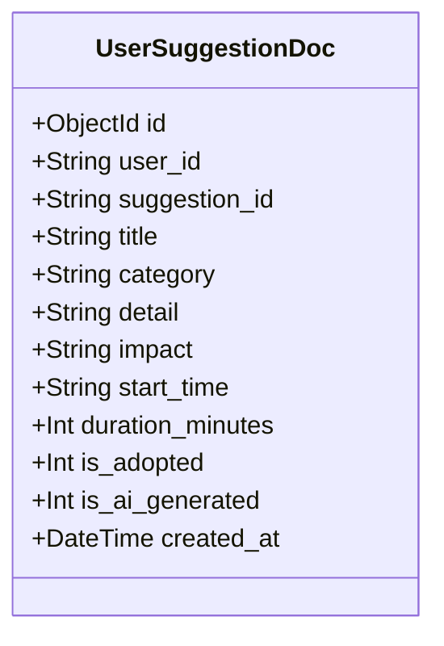

# Workflow Step 6: Task Planner & Smart Suggestions Engine

This document details the role-adapted daily task planner (`/planner`), the data-driven smart suggestions intelligence engine (`/suggestions`), database persistence, and one-click task scheduling.

---

## 1. Role-Tailored Task Categories

The task planner dynamically filters and organizes categories based on the user's active persona:

- **Student**: `["Study", "Exams", "Campus", "Money", "Health", "Social"]`
- **Working Professional**: `["Work", "Career", "Finance", "Health", "Upskilling", "Personal"]`
- **Freelancer / Creator**: `["Client Work", "Projects", "Invoices", "Admin", "Health", "Upskilling"]`
- **Founder / Entrepreneur**: `["Product", "Growth", "Fundraising", "Operations", "Team", "Health"]`
- **Retiree / Senior**: `["Health", "Hobbies", "Finance", "Family", "Home", "Leisure"]`

---

## 2. Smart AI Suggestion Engine (`/suggestions`)

The suggestions engine performs deep data pre-analysis before synthesizing personalized lifestyle, focus, and financial suggestions.

### A. Pre-Analysis Pipeline
Before calling the LLM, the backend analyzes:
1. **Active Role Persona**: Adapts expectations (e.g. Student allowance vs Founder equity runways).
2. **30-Day Measured Baseline**:
   - Sleep averages (detects sleep debt $<7.0$h vs restorative $>8.0$h).
   - Screen time load (identifies digital fatigue $>5.0$h/day).
   - Study & focus hours (assesses consistency vs cramming).
   - Daily active movement & mood scores.
3. **Financial Milestone Targets**: Evaluates current net worth vs retirement/milestone target.
4. **Lifestyle Bottlenecks**: Automatically formulates concise diagnostic callouts that guide the generation prompt.

---

## 3. Database Persistence (`UserSuggestionDoc`)

Suggestions are stored in MongoDB via the `UserSuggestionDoc` Beanie document model, ensuring custom recommendations and adoption states persist across sessions:

---

## 4. Suggestion Actions & REST Endpoints

### 1. Retrieve Suggestions (`GET /suggestions/{user_id}`)
Returns all saved suggestions for the user. If the user is new, automatically initializes pre-calibrated baseline templates for their role.

### 2. Generate Suggestions (`POST /suggestions/generate/{user_id}`)
Accepts `GenerateSuggestionsRequest(mode="regenerate" | "more")`:
- **`mode: "regenerate"`**: Clears previous AI recommendations, re-runs full metric analysis, and persists a fresh set of 4 tailored suggestions.
- **`mode: "more"`**: Synthesizes 3–4 extra complementary suggestions without repeating existing titles and appends them to the user's library.

### 3. Adopt Suggestion (`POST /suggestions/adopt/{user_id}`)
Toggles `is_adopted` in the database, ensuring state synchronization between local browser memory and backend databases.

### 4. Reset Suggestions (`POST /suggestions/reset/{user_id}`)
Clears custom AI suggestions and restores the standard baseline templates for the active role persona.

---

## 5. One-Click Adoption Pipeline

When a user clicks **"Add to tasks"** on any suggestion card:
1. The suggestion is marked as adopted in the frontend store and synced to the database via `adoptSuggestionApi()`.
2. A corresponding `Task` item is created with matching title, start time, duration, and category.
3. The task is injected into **Today's Plan** (`/planner`), allowing the user to mark it done as part of their daily schedule.

## 7. Task Board Injection Lifecycle
- Adopted suggestions instantiate Task models in the daily planner.
- Completion toggles sync progress back to the twin intelligence engine.
