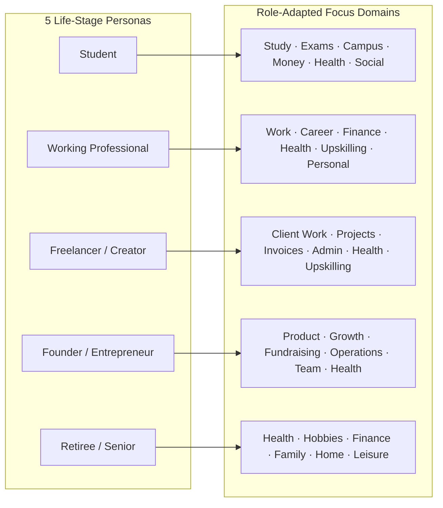
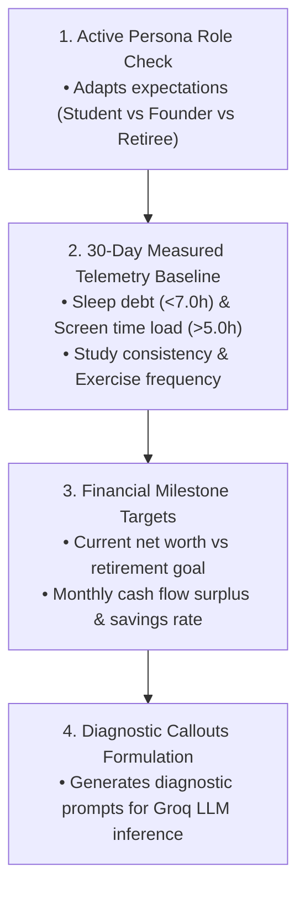
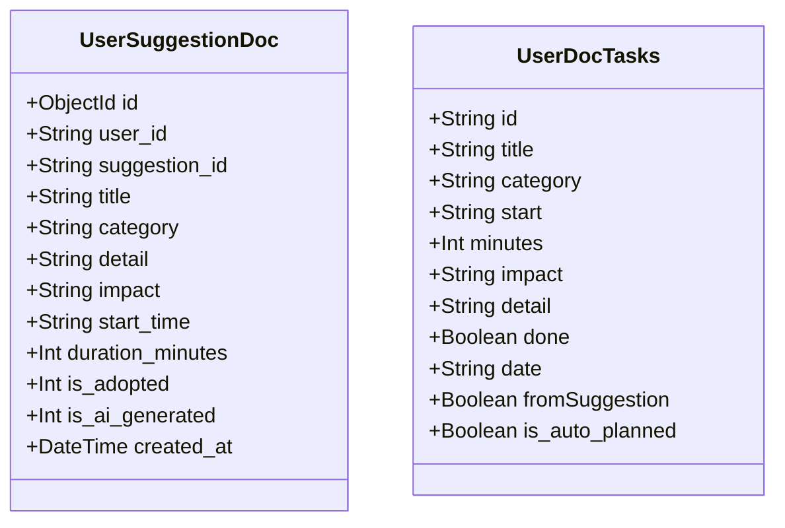
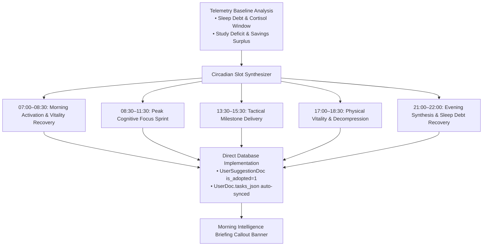
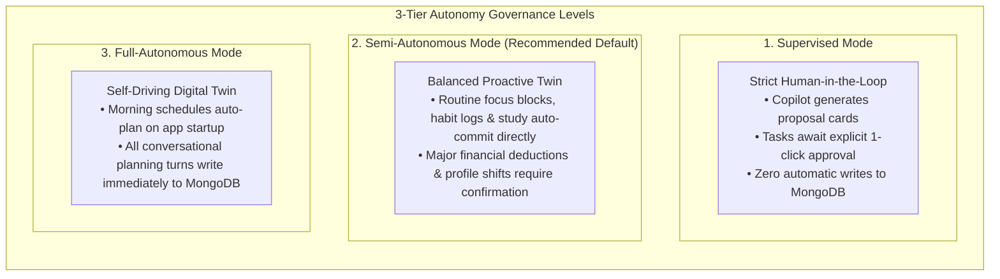
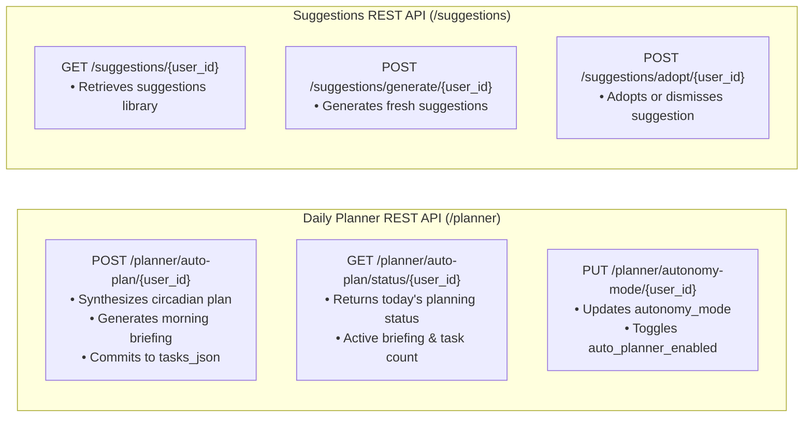

# Workflow Step 6: Task Planner & Smart Suggestions Engine

This document details the role-adapted daily task planner (`/planner`), the data-driven smart suggestions intelligence engine (`/suggestions`), the autonomous circadian auto-planner (`/planner/auto-plan`), and one-click database execution.

---

## 1. Role-Tailored Task Categories

The task planner dynamically filters and organizes categories based on the user's active persona:

---

## 2. Smart AI Suggestion Engine (`/suggestions`)

The suggestions engine performs deep data pre-analysis before synthesizing personalized lifestyle, focus, and financial suggestions.

### Pre-Analysis Pipeline

---

## 3. Database Persistence (`UserSuggestionDoc` & `UserDoc.tasks_json`)

Suggestions and tasks are persisted in MongoDB through Beanie document models:

---

## 4. Autonomous AI Daily Planner & Self-Implementation Engine

The system features an autonomous, proactive circadian planning engine (`ai_engine/auto_planner.py`) and dedicated REST endpoints (`/planner/auto-plan/{user_id}`) that synthesize and commit daily focus routines directly into MongoDB without requiring manual prompts.

### Circadian Optimization Architecture

### 3-Tier Autonomy Governance

Users configure their desired autonomy level in `/settings`:

---

## 5. REST Endpoints for Planning & Suggestions

---

*Back to [README.md](../../README.md)*
