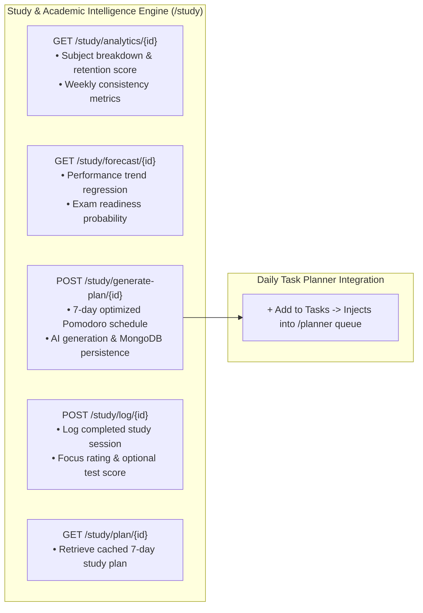

# Workflow Step 07: Study & Productivity Intelligence

This guide describes the **Study & Productivity Intelligence** module: its habit analytics, academic trajectory modeling, exam readiness scoring, and AI study plan generation.

---

## 1. Overview & Role Scoping

Study & Productivity Intelligence (`/study`) is designed specifically for personas that require coursework, exam preparation, and study sprint modeling (primarily the **Student** persona).

- **Role Gate**: For roles without academic study requirements (Working Professional, Freelancer, Entrepreneur, Retiree), the navigation link is omitted from the sidebar, keeping their interface uncluttered.
- **Student Persona**: Full access to habit analytics, exam readiness gauges, performance trajectory forecasts, and AI study schedule generators.

---

## 2. Statistical Models & Forecasting

### A. Performance Trend Regression
Historical test scores and focus ratings ($F \in [1, 10]$ normalized to $0–100$) are fit using linear regression:
$$\text{Slope} = \frac{\sum (x_i - \bar{x})(y_i - \bar{y})}{\sum (x_i - \bar{x})^2}$$

- **Improving**: $\text{Slope} > +0.4$
- **Declining**: $\text{Slope} < -0.4$
- **Stable**: $-0.4 \le \text{Slope} \le +0.4$

### B. Exam & Milestone Readiness Probability
Readiness $P_{\text{ready}} \in [0.1, 0.98]$ is calculated from historical score baselines, target exam score $S_{\text{target}}$, score variance $\sigma$, and weekly study hours $H_{\text{weekly}}$:
$$P_{\text{ready}} = \text{clip}\left(\frac{\bar{S}}{S_{\text{target}}} \cdot 0.75 + \max(0, (10 - \sigma) \cdot 0.02) + \min\left(0.2, \frac{H_{\text{weekly}}}{25} \cdot 0.2\right), 0.1, 0.98\right)$$

### C. Retention & Spaced Repetition Consistency
Measures the regularity of study sessions and flags long gaps (>3 days) using spacing intervals:
$$R_{\text{health}} = \text{clip}(100 - (\bar{G} \cdot 8) - (G_{\text{max}} \cdot 4), 30, 98)$$
where $\bar{G}$ is average day gap and $G_{\text{max}}$ is maximum day gap between sessions.

---

## 3. Core Features & Capabilities

1. **Schedule & Learning Analytics**:
   - Weekly day distribution bar chart (Mon–Sun study hours vs focus score).
   - Subject breakdown (hours invested, average focus, session counts).
   - Sleep-focus correlation index.
   - Quick session logging dialog (Subject, Duration, Focus rating 1–10, Test Score %, Notes).

2. **Performance & Exam Trend Forecasting**:
   - Historical vs projected 4-week academic trajectory chart.
   - Live Exam Readiness Gauge ($0–100\%$).
   - Projected final exam score vs target milestone score.
   - Recommended daily study pace in minutes.

3. **AI Study Optimizer & Schedule**:
   - Powered by Groq LLaMA 3.1 8B with robust deterministic fallbacks.
   - Generates 7-day daily study blocks with start times, Pomodoro intervals, and specific problem-set tasks.
   - **One-Click Task Adoption**: Click `+ Add to Tasks` on any study block to inject it directly into Today's Planner (`/planner`).
   - High-impact cognitive study recommendations.

---

## 4. Endpoints & Data Flow Reference

## 7. Exam Score Readiness Model
- Weights recent practice exam scores ($60\%$) with weekly study consistency ($40\%$).
- Accurately projects milestone target attainment.
