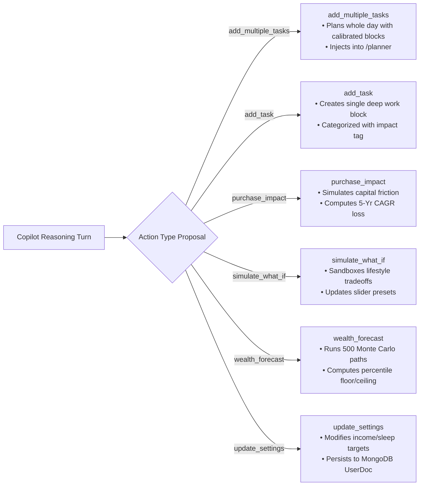
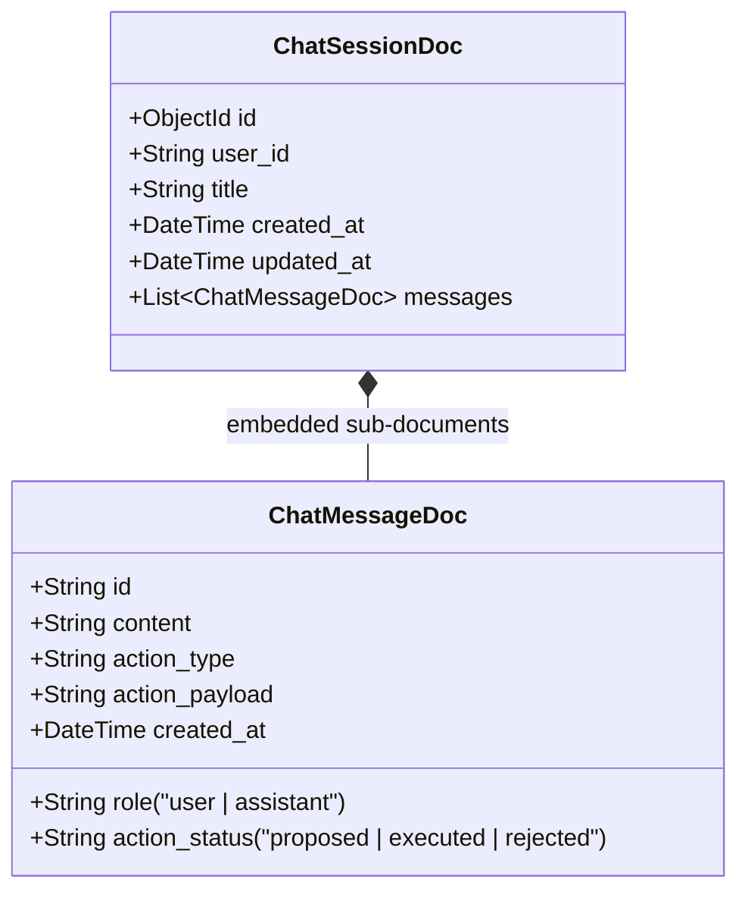

# Workflow Step 8: Visual Risk Copilot & Conversational Agent

This document details the architecture, 4-stage agentic reasoning pipeline, multi-action proposal system, voice recognition, database persistence, and API specification for the **Visual Risk Copilot** (`/chat`).

---

## 1. Overview & Core Purpose

The Visual Risk Copilot is a conversational intelligence agent designed to simulate decisions, optimize daily circadian routines, evaluate financial tradeoffs, and forecast long-term life trajectory.

Unlike generic chatbots, the Copilot is deeply integrated with the user's live database state (biometrics, habit logs, study records, cash flow, and active milestone goals). Every response is backed by mathematical modeling and stochastic simulations, presenting clear `<think>` reasoning blocks and 1-click interactive action proposals.

---

## 2. 4-Stage Agentic Reasoning Pipeline

Whenever a user prompts the Copilot, the AI execution engine processes the turn through four distinct phases:

```
┌─────────────────────────────────────────────────────────────────────────────┐
│  Step 1: Goal Definition                                                 │
│  • Decomposes user inquiry into explicit optimization targets (e.g.         │
│    circadian productivity boost, purchase milestone friction, sleep shifts).│
└──────────────────────────────────────┬──────────────────────────────────────┘
                                       │
┌──────────────────────────────────────▼──────────────────────────────────────┐
│  Step 2: Telemetry Search & Data Gathering                               │
│  • Queries DB habit logs (average sleep, sleep debt, screen time, exercise).│
│  • Gathers study session records, focus subjects, and weekly consistency.   │
│  • Extracts financial cash flow (income, expenses, surplus, savings rate).  │
│  • Pulls active milestone targets (e.g. Emergency Fund $20k, % progress).   │
└──────────────────────────────────────┬──────────────────────────────────────┘
                                       │
┌──────────────────────────────────────▼──────────────────────────────────────┐
│  Step 3: Multi-Criteria Analysis & Optimization                          │
│  • Maps daily cortisol & alertness curves (08:30–11:30 peak cognitive sprint)│
│  • Models biological elasticity tradeoffs (Sleep vs Health Index vs Focus). │
│  • Runs deterministic compound growth and stochastic Monte Carlo forecasts. │
└──────────────────────────────────────┬──────────────────────────────────────┘
                                       │
┌──────────────────────────────────────▼──────────────────────────────────────┐
│  Step 4: Strategic Execution Plan & Action Proposal                      │
│  • Synthesizes executive summary and unbroken GitHub-Flavored Markdown table│
│  • Attaches interactive 1-click Action Proposal Card for direct DB commit.  │
└─────────────────────────────────────────────────────────────────────────────┘
```

---

## 3. Interactive Multi-Action Proposal System

Copilot responses can attach structured actionable payloads (`action_type`, `action_payload`, `action_status`) that require explicit user approval before execution:



---

## 4. Collapsible Step-by-Step Reasoning (`<think>`)

When **Think Mode** is active, the model generates an explicit reasoning block wrapped in `<think>...</think>` tags:
- Formats step-by-step mathematical computations, baseline deltas, and probability variance.
- Displayed in the chat UI as a collapsible accordion badge (*"Thought Process"*) with a brain icon and monospace formatting.
- Can be toggled on/off on demand via the UI Think switch or in `/settings`.

---

## 5. Voice Input & Speech Recognition

- **Web Speech API Integration**: Built-in voice dictation allowing hands-free interaction with the Copilot.
- **Audio Waveform Feedback**: Visual listening indicator pulsing in real time while capturing speech.
- **Auto-Transcription**: Automatically populates the chat prompt input and enables instantaneous turn submission.

---

## 6. Database Models & Schema

Chat interactions are persisted in MongoDB through Beanie Document models with embedded messages:



---

## 7. REST API Endpoints Specification

### 1. List User Chat Sessions
- **Endpoint**: `GET /chat/sessions/{user_id}`
- **Description**: Returns all conversation sessions belonging to the user with message count and preview.

### 2. Create Thread & Send First Message
- **Endpoint**: `POST /chat/message/create_thread`
- **Request Body**:
  ```json
  {
    "user_id": 1,
    "prompt": "can you add some suggestion for my task to boost my productivity",
    "think_mode": true,
    "client_context": { "goalName": "Emergency Fund", "goalTarget": 20000, "goalCurrent": 8500 }
  }
  ```
- **Response**: Generates a new `ChatSession` with an AI-summarized title, creates the user message, and returns the assistant response with action proposals.

### 3. Send Turn Message in Existing Session
- **Endpoint**: `POST /chat/message/{session_id}`
- **Authorization**: Enforces user ownership (`403 Forbidden` if `session.user_id != req.user_id`).

### 4. Approve & Execute Proposed Action
- **Endpoint**: `POST /chat/action/execute/{message_id}`
- **Request Body**:
  ```json
  {
    "user_id": 1,
    "action_type": "add_multiple_tasks",
    "action_payload": { "tasks": [...] }
  }
  ```
- **Effect**: Persists tasks or profile updates into the database and updates `action_status` to `"executed"`.

### 5. Dismiss Proposed Action
- **Endpoint**: `POST /chat/action/reject/{message_id}`
- **Effect**: Updates `action_status` to `"rejected"` in the database.

---

## 8. Markdown & Table Rendering Engine

In [`frontend/src/components/twin-chat.tsx`](../../frontend/src/components/twin-chat.tsx), the chat interface utilizes `ReactMarkdown` with `remark-gfm`:
- **Contiguous Table Normalization**: Strips disruptive empty lines inside markdown tables so rows remain contiguous.
- **Native GFM Styling**: Styled `<table>`, `<thead>`, `<tbody>`, `<tr>`, `<th>`, and `<td>` components with responsive horizontal scrolling, dark-mode borders, and row hover states.
