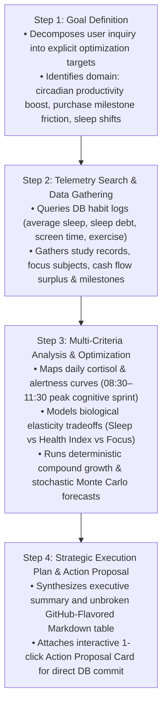
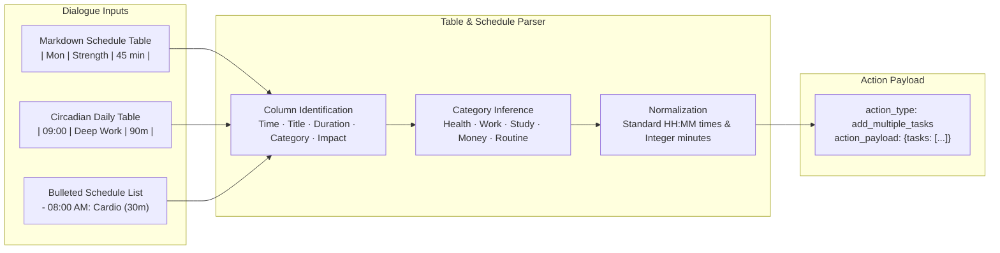
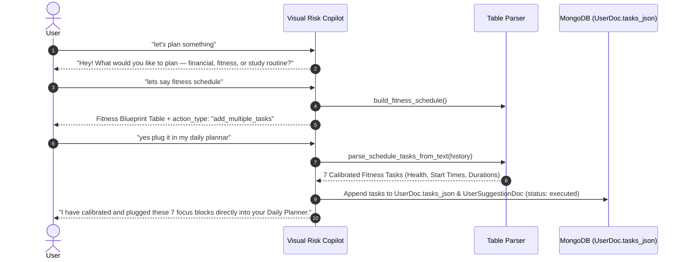
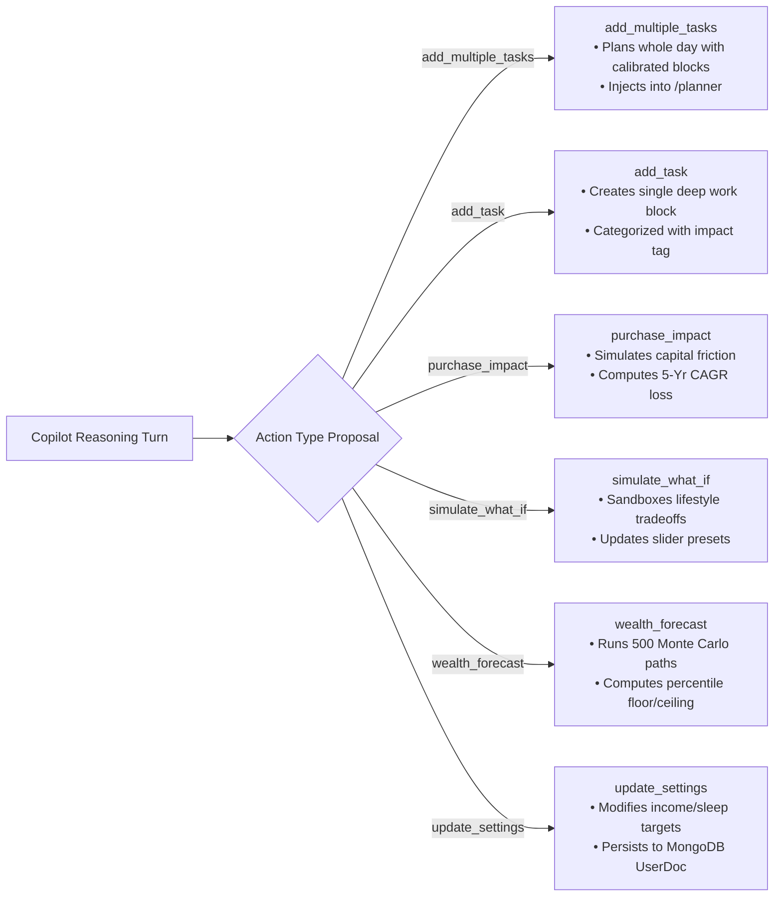
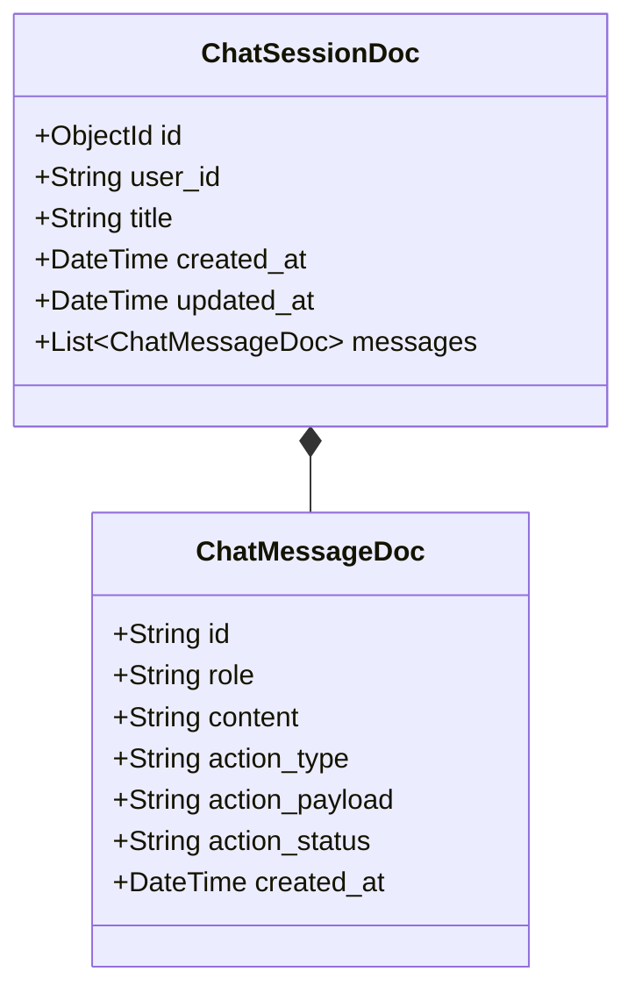
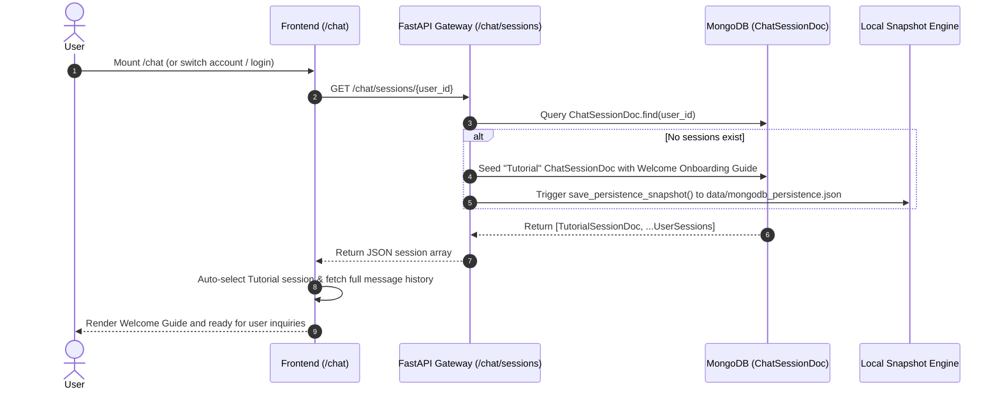
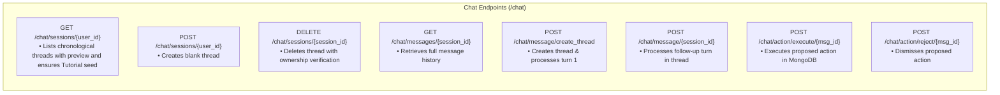

# Workflow Step 8: Visual Risk Copilot & Conversational Agent

This document details the architecture, 4-stage agentic reasoning pipeline, dynamic schedule table parser, multi-action proposal system, voice recognition, database persistence, and API specification for the **Visual Risk Copilot** (`/chat`).

---

## 1. Overview & Core Purpose

The Visual Risk Copilot is a conversational intelligence agent designed to simulate decisions, optimize daily circadian routines, evaluate financial tradeoffs, and forecast long-term life trajectory.

Unlike generic chatbots, the Copilot is deeply integrated with the user's live database state (biometrics, habit logs, study records, cash flow, and active milestone goals). Every response is backed by mathematical modeling and stochastic simulations, presenting clear `<think>` reasoning blocks and 1-click interactive action proposals.

---

## 2. 4-Stage Agentic Reasoning Pipeline

Whenever a user prompts the Copilot, the AI execution engine processes the turn through four distinct phases:

---

## 3. Dynamic Schedule Table & List Parsing Engine

The system features a dedicated parsing engine (`ai_engine/llm_integration/table_parser.py`) that extracts structured tasks from any Markdown table or bulleted list generated in dialogue turns:

---

## 4. Multi-Turn Planning Dialogue Flow

When users ask to plan a routine across multiple dialogue turns, the Copilot seamlessly tracks context, extracts history tables, and commits tasks to the Daily Planner:

---

## 5. Interactive Multi-Action Proposal System

Copilot responses can attach structured actionable payloads (`action_type`, `action_payload`, `action_status`) that execute directly or await 1-click user approval based on the active autonomy mode:

---

## 6. Collapsible Step-by-Step Reasoning (`<think>`)

When **Think Mode** is active, the model generates an explicit reasoning block wrapped in `<think>...</think>` tags:
- Formats step-by-step mathematical computations, baseline deltas, and probability variance.
- Displayed in the chat UI as a collapsible accordion badge (*"Thought Process"*) with a brain icon and monospace formatting.
- Can be toggled on/off on demand via the UI Think switch or in `/settings`.

---

## 7. Voice Input & Speech Recognition

- **Web Speech API Integration**: Built-in voice dictation allowing hands-free interaction with the Copilot.
- **Audio Waveform Feedback**: Visual listening indicator pulsing in real time while capturing speech.
- **Auto-Transcription**: Automatically populates the chat prompt input and enables instantaneous turn submission.

---

## 8. Database Models & Schema

Chat interactions are persisted in MongoDB through Beanie Document models with embedded messages:

---

## 9. Persistent Tutorial Guide Thread & User Lifecycle Recovery

Every user account in Visual Risk AI is initialized with a dedicated, persistent **Tutorial** conversational thread upon creation or login:

### Key Lifecycle Guarantees:
1. **Eager Tutorial Seeding**: When `crud.create_user()` or `crud.get_or_create_demo_user()` is executed, the Tutorial thread is immediately written to MongoDB and persisted to disk.
2. **Account Switch / Logout Isolation**: When a user logs out and a different user logs in, the active session state and message history reset cleanly, loading the new user's threads without ghost state.
3. **Lossless Recovery**: If a user logs out and logs back in, all custom conversation threads and the Tutorial thread are restored with intact `<think>` reasoning trees and action statuses.

---

## 10. Embedded Database & Local Disk Persistence Engine

For standalone deployments and offline environments, Visual Risk AI features an embedded MongoDB document engine paired with an automatic JSON snapshot persistence layer (`data/mongodb_persistence.json`):

- **Automatic Snapshotting**: Every create, update, and delete operation on `UserDoc`, `ChatSessionDoc`, `HabitRecordDoc`, `StudyRecordDoc`, `FinancialRecordDoc`, and `UserSuggestionDoc` invokes `save_persistence_snapshot()`.
- **Atomic File Swapping**: Persistence snapshots write to a temporary file (`.tmp`) and atomically replace the destination file to prevent corruption.
- **Auto-Rehydration on Startup**: Upon backend boot, `load_persistence_snapshot()` restores all collections, users, and conversational histories into the active document store.

---

## 11. REST API Reference for Chat

---

*Back to [README.md](../../README.md)*
